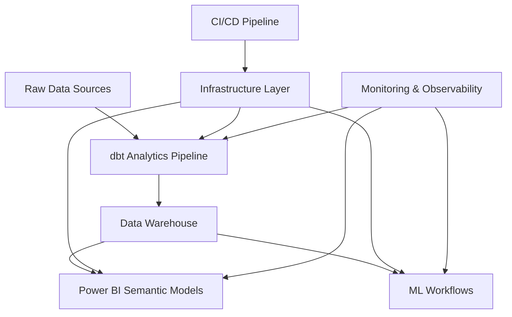

# Modern Data Stack Showcase

> A comprehensive demonstration of advanced data engineering patterns, sophisticated analytics architectures, and enterprise-grade platform engineering practices.

[](https://www.getdbt.com/)
[](https://docs.microsoft.com/en-us/power-bi/)
[](https://python.org)
[](https://docker.com)
[](https://github.com/features/actions)

## 🎯 Overview

This project showcases modern data stack best practices through a comprehensive, anonymized implementation that emphasizes **technical depth over business context**. It demonstrates advanced patterns in data transformation, semantic modeling, machine learning workflows, and platform engineering.

### Key Technical Highlights

- **🔄 Enterprise dbt Patterns**: Sophisticated macro library with query tracking, table governance, metadata-driven cleaning, and performance optimization
- **📊 Multi-Target Power BI Architecture**: TMDL-based semantic modeling with master/child inheritance patterns
- **🤖 Complete ML Workflows**: Feature engineering, model training, evaluation, and deployment automation
- **🚀 Platform Engineering**: Infrastructure as code, observability, CI/CD automation
- **📚 Progressive Documentation**: Architecture diagrams, technical tutorials, decision records
- **🎯 Data Governance**: Automated query metadata, table labeling, execution auditing, and freshness monitoring
- **🏗️ Layered Architecture**: 7-layer processing pipeline with source prioritization and quality automation

## 🏗️ Architecture



## 🎯 Enterprise Features

### Advanced Macro Library

The project includes a sophisticated macro library providing enterprise-grade capabilities:

#### **Query Metadata & Tracking**
- **Automated Query Comments**: Every query includes comprehensive metadata for cost tracking and debugging
- **BigQuery Label Management**: Automatic table labeling for governance and cost optimization
- **Environment Detection**: Intelligent dev/test/prod environment classification
- **Model Type Classification**: Automatic fact/dimension/aggregate model detection

```sql
-- Automatically injected metadata includes:
-- model=sales_fact, schema=elt, environment=dev, dbt_version=1.8.0
-- materialization=incremental, tags=critical,fact_table
```

#### **Table Management & Governance**
- **Automated Table Labeling**: BigQuery tables receive governance labels automatically
- **Execution Auditing**: Comprehensive model execution tracking with metadata
- **Data Freshness Monitoring**: Configurable staleness detection with smart thresholds
- **Performance Optimization**: Intelligent partition and cluster field management

```sql
-- Enterprise post-hooks on critical models:
post_hook: [
    "{{ set_table_labels() }}",
    "{{ audit_model_execution() }}"
]
```

#### **Data Quality & Cleaning**
- **Metadata-Driven Cleaning**: Automatic data type-specific transformations
- **Source Prioritization**: Advanced deduplication with configurable priority rules
- **NULL Handling**: Intelligent null value treatment by data type
- **Control Character Removal**: Automatic cleanup of data quality issues

```sql
-- Automatic cleaning applied to all source data:
{{ select_clean_from_metadata(ref('source_table')) }}
```

### Configuration Examples

#### **Global Query Tracking** (dbt_project.yml)
```yaml
query-comment:
  comment: "{{ query_comment() }}"
  job-label: true

models:
  modern_data_stack_showcase:
    +post-hook:
      - "{{ audit_model_execution() }}"
```

#### **Critical Model Enhancement**
```sql
{{
    config(
        materialized='table',
        post_hook=[
            "{{ set_table_labels() }}",
            "{{ audit_model_execution() }}"
        ],
        tags=['critical', 'fact_table']
    )
}}
```

### Data Architecture Patterns

#### **Layered Processing Pipeline**
```
Raw Data → Direct → Source → Cleaned → Staging → Normalized → Denormalized → Analytics
```

- **Direct Layer**: Raw data ingestion with minimal transformation
- **Source Layer**: Source priority deduplication and standardization
- **Cleaned Layer**: Metadata-driven data quality improvements
- **Staging Layer**: Business logic transformations and calculations
- **Normalized Layer**: Dimensional modeling with surrogate keys
- **Denormalized Layer**: Analytics-ready wide tables
- **Analytics Layer**: Aggregated business intelligence models

#### **Enterprise Connector Pattern**
Each connector (retail_connector, grocery_connector) follows identical patterns:
- Consistent naming conventions and structure
- Shared macro library for common transformations
- Standardized data quality and governance
- Scalable architecture for multi-tenant scenarios

## 📁 Project Structure

```
modern-data-stack-showcase/
├── dbt-analytics/                  # Advanced dbt project with sophisticated patterns
│   ├── models/                     # Layered architecture: direct → source → cleaned → staging → normalized → denormalized → analytics
│   ├── macros/                     # Enterprise macro library with governance, quality, and optimization features
│   ├── tests/                      # Comprehensive data quality framework
│   └── docs/                       # Auto-generated dbt documentation
├── powerbi-models/                 # TMDL-based Power BI semantic models
│   ├── master-model/               # Core semantic model with advanced calculations
│   ├── child-model/                # Inherited model variant demonstrating scalability
│   └── deployment/                 # Azure DevOps CI/CD pipeline templates
├── notebooks/                      # Jupyter notebook showcase
│   ├── data-exploration/           # Pandas, visualization, statistical analysis
│   ├── ml-workflows/               # Feature engineering, model training, evaluation
│   ├── devops-automation/          # Deployment, monitoring, testing automation
│   └── business-intelligence/      # Report automation and dashboard generation
├── infrastructure/                 # Platform engineering and DevOps
│   ├── docker/                     # Multi-stage containerization
│   ├── kubernetes/                 # Orchestration and scaling patterns
│   └── ci-cd/                      # GitHub Actions workflows
├── docs/                           # Technical documentation and tutorials
│   ├── tutorials/                  # Progressive tutorial series
│   ├── architecture/               # System design and decision records
│   ├── deployment/                 # Deployment guides and procedures
│   └── troubleshooting/            # FAQ and operational support
└── sample-data/                    # Synthetic datasets and data generators
    ├── raw/                        # Source system data simulation
    ├── processed/                  # Transformed datasets
    └── generators/                 # Python scripts for realistic data generation
```

## 🚀 Quick Start

### Prerequisites

- Python 3.12+
- Docker & Docker Compose
- Poetry (for Python dependency management)
- Node.js 18+ (for documentation generation)

### Local Development Setup

1. **Clone and setup the environment:**
   ```bash
   git clone <repository-url>
   cd modern-data-stack-showcase
   poetry install
   poetry shell
   ```

2. **Start the development environment:**
   ```bash
   docker-compose up -d
   ```

3. **Initialize sample data:**
   ```bash
   python sample-data/generators/generate_retail_data.py
   ```

4. **Run dbt models:**
   ```bash
   cd dbt-analytics
   dbt deps
   dbt seed
   dbt run
   dbt test
   ```

5. **Access services:**
   - **dbt Documentation**: http://localhost:8080
   - **Jupyter Lab**: http://localhost:8888
   - **Monitoring Dashboard**: http://localhost:3000

## 🔍 Featured Patterns & Techniques

### dbt Analytics Pipeline

- **Enterprise Macro Library**: Query metadata tracking, table governance, data quality automation, and performance optimization
- **Layered Architecture**: 7-layer processing pipeline from raw ingestion to analytics-ready models
- **Source Prioritization**: Advanced deduplication with configurable priority rules for multi-source data integration
- **Metadata-Driven Cleaning**: Automatic data type-specific transformations and quality improvements
- **Query Tracking**: Comprehensive metadata injection for cost tracking, debugging, and governance
- **Table Management**: Automated BigQuery labeling, execution auditing, and freshness monitoring
- **Advanced Incremental Loading**: Time-partitioned incremental strategies with sophisticated deduplication
- **Testing Framework**: Comprehensive data quality tests with custom test macros
- **Multi-Environment Management**: Seamless dev/staging/production configuration

### Power BI Semantic Modeling

- **TMDL Development**: Modern semantic modeling with Tabular Model Definition Language
- **Master/Child Architecture**: Scalable model inheritance patterns for multi-tenant scenarios
- **Advanced DAX**: Complex calculations, time intelligence, and performance optimization
- **CI/CD Integration**: Automated deployment and testing with Azure DevOps

### Machine Learning Workflows

- **Feature Engineering**: Automated feature selection, transformation, and validation
- **Model Training**: Scikit-learn pipelines with hyperparameter optimization
- **MLOps Patterns**: Model versioning, monitoring, and automated retraining
- **Deployment Automation**: Container-based model serving with monitoring

### Platform Engineering

- **Infrastructure as Code**: Kubernetes manifests and Helm charts
- **Observability**: Comprehensive logging, monitoring, and alerting
- **CI/CD Automation**: Multi-stage pipelines with testing and deployment
- **Security**: Secret management, RBAC, and compliance patterns

## 📊 Technical Deep Dives

### [Enterprise dbt Patterns](docs/tutorials/01-enterprise-dbt-patterns.md)
Explore sophisticated transformation patterns, enterprise macro development, and performance optimization techniques.

#### **Macro Library Deep Dive**
- **Query Metadata Suite**: Automated query comments, BigQuery labels, environment detection, and model classification
- **Table Management**: Execution auditing, data freshness monitoring, and automated governance
- **Data Quality**: Metadata-driven cleaning, source prioritization, and transformation automation
- **Performance Optimization**: Intelligent partitioning, clustering, and incremental strategies

### [Power BI Architecture Design](docs/tutorials/02-powerbi-architecture-design.md)
Learn about TMDL development workflows, semantic modeling best practices, and deployment automation.

### [ML Pipeline Engineering](docs/tutorials/03-ml-pipeline-engineering.md)
Discover feature engineering patterns, model training workflows, and MLOps implementation strategies.

### [Progressive Tutorial Series](docs/tutorials/README.md)
Complete hands-on learning path from data transformation through ML operations with step-by-step implementation guides.

## 🧪 Testing & Quality Assurance

- **dbt Tests**: 200+ data quality tests covering completeness, accuracy, and consistency
- **Unit Testing**: Comprehensive Python test suite with 95%+ coverage
- **Integration Testing**: End-to-end pipeline validation
- **Performance Testing**: Query optimization and benchmark validation
- **Security Testing**: Data privacy and access control validation

## 📈 Performance & Scalability

- **Query Optimization**: Materialization strategies and incremental processing
- **Parallel Processing**: Multi-threaded execution and resource optimization
- **Caching Strategies**: Intelligent data caching and refresh policies
- **Monitoring**: Real-time performance metrics and alerting

## 🔒 Data Governance & Security

- **Data Lineage**: Automated tracking of data transformations and dependencies
- **Access Controls**: Role-based access patterns and audit logging
- **Data Quality**: Automated validation and anomaly detection
- **Compliance**: GDPR/CCPA patterns and data retention policies

## 📚 Documentation

- **[Architecture Overview](documentation/architecture/system-design.md)**: Complete system design and component interactions
- **[API Documentation](documentation/api/)**: Comprehensive API reference and examples
- **[Deployment Guide](documentation/deployment/)**: Step-by-step deployment instructions
- **[Troubleshooting](documentation/troubleshooting/)**: Common issues and solutions

## 🤝 Contributing

This project demonstrates production-ready patterns and welcomes contributions that enhance the technical sophistication:

1. **Fork the repository**
2. **Create a feature branch**: `git checkout -b feature/advanced-pattern`
3. **Implement with tests**: Ensure comprehensive test coverage
4. **Submit a pull request**: Include detailed technical documentation

## 📄 License

This project is available under the MIT License - see the [LICENSE](LICENSE) file for details.

## 🏷️ Keywords

`dbt` `Power BI` `TMDL` `BigQuery` `Machine Learning` `MLOps` `Docker` `Kubernetes` `CI/CD` `Data Engineering` `Analytics` `Platform Engineering` `Infrastructure as Code` `Data Governance` `Performance Optimization` `Enterprise Macros` `Query Metadata` `Table Management` `Data Quality` `Source Prioritization` `Metadata-Driven Cleaning`

---

**Technical Excellence Demonstrated**: This showcase represents production-grade implementations of modern data stack patterns, emphasizing architectural sophistication, performance optimization, and enterprise-scale considerations. Features include comprehensive query metadata tracking, automated table governance, metadata-driven data quality, and sophisticated macro libraries for enterprise-grade data operations. 
