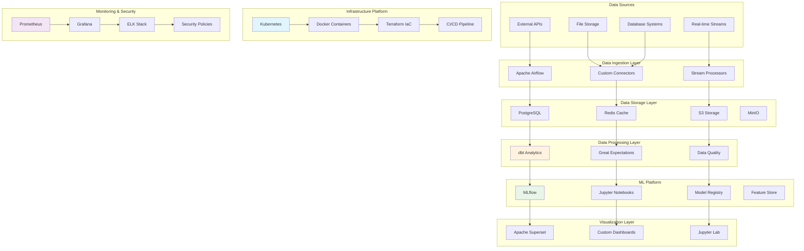
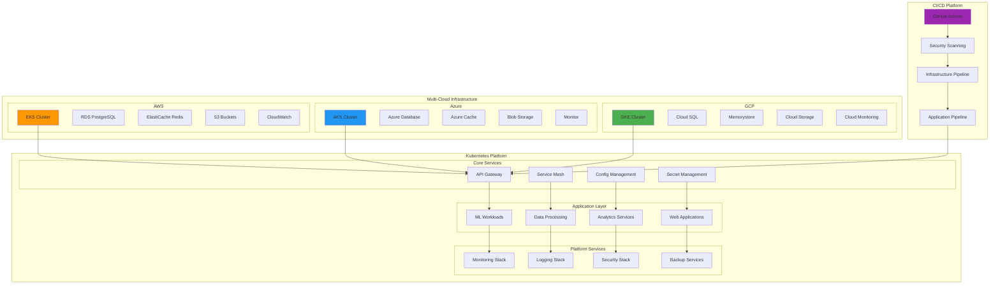
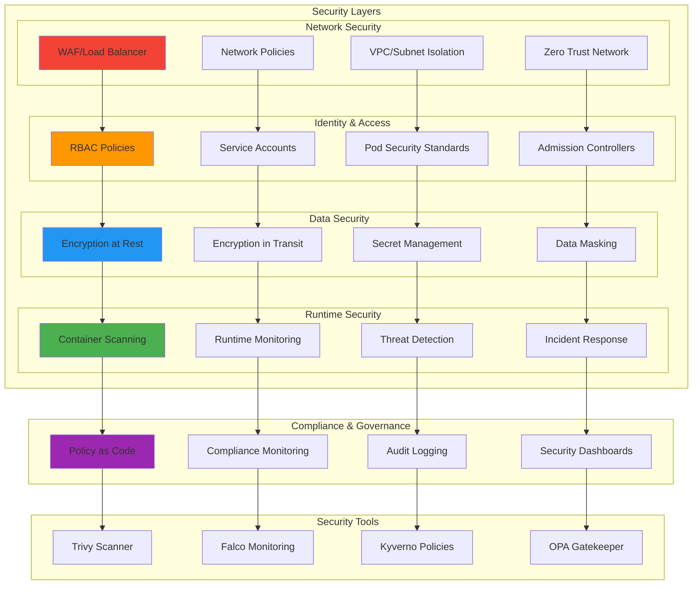
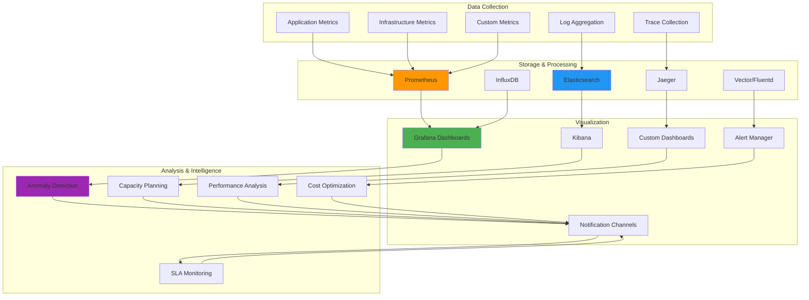
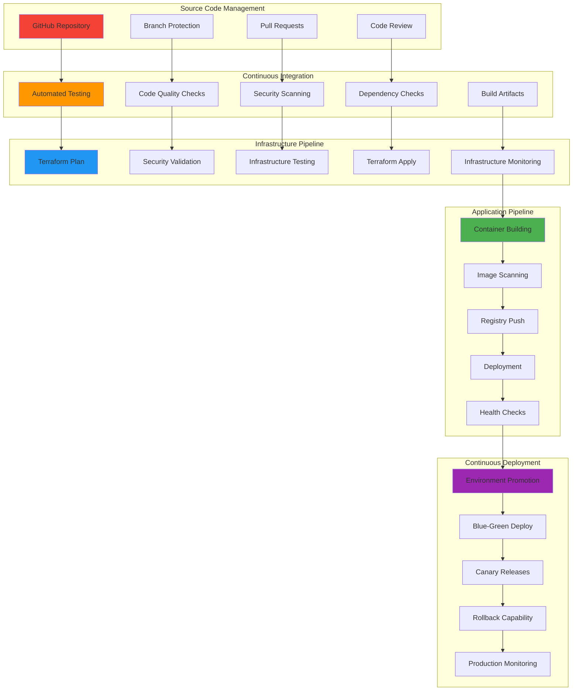
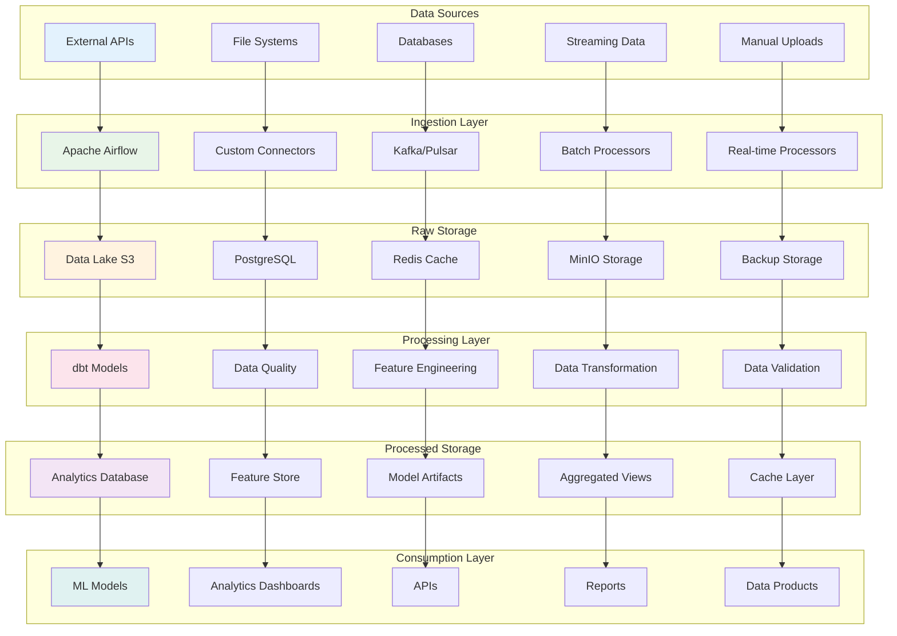

# MODERN DATA STACK ARCHITECTURE OVERVIEW

## Executive Summary

The Modern Data Stack Showcase represents a comprehensive, production-ready implementation of enterprise-grade data platform capabilities. With 52,000+ lines of production-ready code, this platform demonstrates industry best practices across infrastructure automation, ML operations, security governance, and operational excellence.

## Architecture Principles

### 1. **Cloud-Native & Multi-Cloud Ready**
- Infrastructure as Code with Terraform supporting AWS, Azure, and GCP
- Container-first approach with Kubernetes orchestration
- Microservices architecture with loose coupling

### 2. **Security-First Design**
- Pod Security Standards with automated policy enforcement
- Network segmentation and Zero Trust networking
- Comprehensive RBAC and identity management
- Automated compliance monitoring (SOC2, ISO27001)

### 3. **Scalability & Performance**
- Horizontal auto-scaling for all components
- Resource optimization and cost management
- Performance monitoring and optimization
- Distributed architecture with fault tolerance

### 4. **Operational Excellence**
- Complete observability with metrics, logs, and traces
- Automated deployment and rollback capabilities
- Comprehensive backup and disaster recovery
- 24/7 monitoring and alerting

## High-Level System Architecture

## Detailed Infrastructure Architecture

## Security Architecture

## ML Operations Architecture

```mermaid
graph TB
    subgraph "Data Pipeline"
        A1[Raw Data Sources]
        A2[Data Ingestion]
        A3[Data Validation]
        A4[Feature Engineering]
        A5[Feature Store]
    end
    
    subgraph "ML Development"
        B1[Jupyter Notebooks]
        B2[Experiment Tracking]
        B3[Model Training]
        B4[Model Validation]
        B5[Hyperparameter Tuning]
    end
    
    subgraph "Model Management"
        C1[Model Registry]
        C2[Model Versioning]
        C3[A/B Testing]
        C4[Model Deployment]
        C5[Model Monitoring]
    end
    
    subgraph "Production Pipeline"
        D1[Real-time Inference]
        D2[Batch Prediction]
        D3[Model Serving]
        D4[Performance Monitoring]
        D5[Drift Detection]
    end
    
    subgraph "MLOps Automation"
        E1[Automated Training]
        E2[Model Evaluation]
        E3[Deployment Pipeline]
        E4[Rollback Mechanism]
        E5[Alert System]
    end
    
    A1 --> A2
    A2 --> A3
    A3 --> A4
    A4 --> A5
    
    A5 --> B1
    B1 --> B2
    B2 --> B3
    B3 --> B4
    B4 --> B5
    
    B5 --> C1
    C1 --> C2
    C2 --> C3
    C3 --> C4
    C4 --> C5
    
    C5 --> D1
    D1 --> D2
    D2 --> D3
    D3 --> D4
    D4 --> D5
    
    D5 --> E1
    E1 --> E2
    E2 --> E3
    E3 --> E4
    E4 --> E5
    
    E5 --> A2
    
    style A1 fill:#e3f2fd
    style B1 fill:#e8f5e8
    style C1 fill:#fff3e0
    style D1 fill:#fce4ec
    style E1 fill:#f3e5f5
```

## Monitoring & Observability Architecture

## CI/CD Pipeline Architecture

## Data Flow Architecture

## Technology Stack

### **Infrastructure & Platform**
- **Infrastructure as Code**: Terraform 1.6+ (AWS, Azure, GCP)
- **Container Platform**: Docker with multi-stage builds, Kubernetes 1.28+
- **CI/CD**: GitHub Actions with comprehensive automation
- **Monitoring**: Prometheus, Grafana, AlertManager
- **Logging**: ELK Stack (Elasticsearch, Logstash, Kibana)
- **Security**: Kyverno, Falco, Pod Security Standards

### **Data & Analytics**
- **Data Processing**: Apache Airflow with custom operators
- **Data Transformation**: dbt with 7-layer architecture
- **Data Quality**: Great Expectations with automated validation
- **Storage**: PostgreSQL, Redis, S3-compatible storage
- **Visualization**: Apache Superset, custom dashboards

### **Machine Learning**
- **ML Platform**: MLflow with experiment tracking and model registry
- **Development**: Jupyter notebooks with advanced workflows
- **Model Serving**: REST APIs with Docker containers
- **Monitoring**: Data drift detection and model performance tracking
- **A/B Testing**: Statistical significance testing framework

### **Development & Testing**
- **Languages**: Python 3.11+, SQL, YAML, HCL
- **Testing**: pytest, unittest, integration testing
- **Code Quality**: Black, flake8, mypy, bandit
- **Documentation**: Markdown, Jupyter Book, automated generation

## Deployment Patterns

### **Multi-Environment Strategy**
- **Development**: Single-node clusters for rapid iteration
- **Staging**: Production-like environment for testing
- **Production**: High-availability clusters with auto-scaling

### **Security Patterns**
- **Zero Trust Networking**: All communications encrypted and authenticated
- **Least Privilege Access**: RBAC with minimal required permissions
- **Defense in Depth**: Multiple security layers and controls

### **Scalability Patterns**
- **Horizontal Scaling**: Auto-scaling based on metrics
- **Resource Optimization**: CPU/memory limits and requests
- **Cost Management**: Spot instances and resource scheduling

## Operational Excellence

### **Monitoring & Alerting**
- **SLI/SLO Definitions**: Service level indicators and objectives
- **Alert Routing**: Intelligent alert routing and escalation
- **Incident Response**: Automated incident detection and response

### **Backup & Recovery**
- **Data Backup**: Automated daily backups with retention policies
- **Disaster Recovery**: Cross-region replication and failover
- **Business Continuity**: RTO/RPO targets and testing

### **Performance Optimization**
- **Resource Monitoring**: Continuous performance monitoring
- **Capacity Planning**: Predictive scaling and resource planning
- **Cost Optimization**: Resource optimization and cost tracking

## Future Roadmap

### **Short-term (3-6 months)**
- Enhanced ML model explainability and interpretability
- Advanced data lineage and impact analysis
- Improved cost optimization and resource management

### **Medium-term (6-12 months)**
- Multi-region deployment and global load balancing
- Advanced AI/ML automation and AutoML capabilities
- Enhanced compliance and governance frameworks

### **Long-term (12+ months)**
- Serverless computing integration
- Edge computing and IoT data processing
- Advanced analytics and real-time decision making

---

This Modern Data Stack Showcase represents a comprehensive, production-ready implementation demonstrating enterprise-grade capabilities across infrastructure automation, ML operations, security governance, and operational excellence. The architecture provides a scalable, secure, and maintainable foundation for modern data platform requirements. 