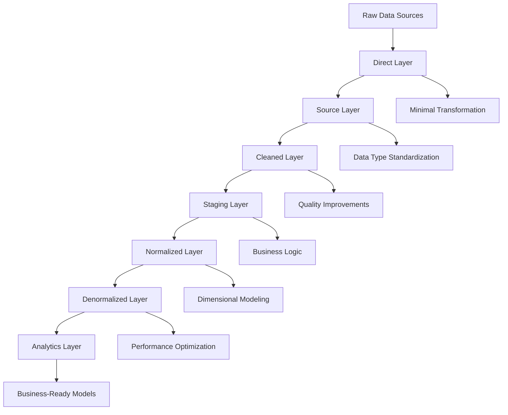

# Tutorial 1: Enterprise dbt Patterns

## 🎯 **Learning Objectives**

By the end of this tutorial, you will:
- Understand and implement the 7-layer data pipeline architecture
- Create advanced dbt macros for data quality and transformation
- Develop comprehensive testing strategies for data validation
- Configure multi-connector data modeling patterns
- Deploy production-ready dbt workflows with monitoring

## 📋 **Prerequisites**

### **Required Knowledge**
- Basic SQL proficiency
- Understanding of data warehousing concepts (facts, dimensions, ETL)
- Familiarity with dbt fundamentals (models, tests, macros)
- Git version control basics

### **Required Tools**
- **dbt Core 1.6+** or dbt Cloud account
- **BigQuery** access (or other supported data warehouse)
- **Python 3.8+** for package management
- **Git** for version control
- **Code Editor** (VS Code recommended with dbt extension)

### **Environment Setup**
```bash
# Clone the repository
git clone <repository-url>
cd modern-data-stack-showcase

# Install dbt dependencies
cd dbt-analytics
pip install dbt-bigquery
dbt deps

# Configure your profiles.yml
dbt debug
```

## 📚 **Core Concepts**

### **7-Layer Architecture Overview**

The Modern Data Stack Showcase implements a sophisticated 7-layer data pipeline architecture inspired by enterprise patterns:



### **Layer Responsibilities**

1. **Direct Layer**: Raw data ingestion with minimal transformation
2. **Source Layer**: Data type standardization and basic cleansing
3. **Cleaned Layer**: Data quality improvements and standardization
4. **Staging Layer**: Business logic preparation and enrichment
5. **Normalized Layer**: Dimensional modeling (star schema)
6. **Denormalized Layer**: Performance-optimized aggregations
7. **Analytics Layer**: Business-ready models for consumption

## 🔨 **Hands-On Implementation**

### **Step 1: Understanding the Direct Layer**

Navigate to the direct layer models:
```bash
cd models/crisp_platform/elt/retail_connector/direct/
```

**Examine the Direct Layer Pattern:**
```sql
-- models/crisp_platform/elt/retail_connector/direct/exp_direct_retail_connector_sales.sql
{{ config(
    materialized='view',
    tags=['direct', 'retail_connector']
) }}

SELECT
    -- Minimal transformation, just aliasing for consistency
    sales_id,
    date_key,
    store_id,
    product_id,
    sales_amount,
    sales_quantity,
    retailer_id,
    created_at,
    updated_at
FROM {{ ref('staging_retail_sales_transactions') }}
```

**Key Principles:**
- **Minimal transformation**: Only basic column aliasing
- **Source preservation**: Maintain original data structure
- **Metadata retention**: Keep audit columns (created_at, updated_at)
- **Tagging strategy**: Consistent tagging for layer and connector

### **Step 2: Implementing the Source Layer**

**Source Layer Example:**
```sql
-- models/crisp_platform/elt/retail_connector/source/exp_source_retail_connector_sales.sql
{{ config(
    materialized='table',
    tags=['source', 'retail_connector']
) }}

SELECT
    -- Data type standardization
    CAST(sales_id AS STRING) AS sales_id,
    PARSE_DATE('%Y%m%d', CAST(date_key AS STRING)) AS date_key,
    CAST(store_id AS STRING) AS store_id,
    CAST(product_id AS STRING) AS product_id,
    
    -- Null handling and validation
    COALESCE(sales_amount, 0.0) AS sales_amount,
    COALESCE(sales_quantity, 0) AS sales_quantity,
    
    -- Standardized metadata
    CAST(retailer_id AS STRING) AS retailer_id,
    CURRENT_TIMESTAMP() AS processed_at
    
FROM {{ ref('exp_direct_retail_connector_sales') }}
WHERE date_key IS NOT NULL
  AND sales_amount >= 0
  AND sales_quantity >= 0
```

**Practice Exercise:**
Create a source layer model for inventory data:

```sql
-- Your task: Create exp_source_retail_connector_inventory.sql
-- Apply the same patterns:
-- 1. Data type standardization
-- 2. Null handling
-- 3. Basic validation
-- 4. Metadata enrichment
```

### **Step 3: Advanced Macro Development**

**Create a Data Quality Macro:**
```sql
-- macros/data_quality/audit_model_execution.sql

    SELECT
        '{{ model_name }}' AS model_name,
        COUNT(*) AS row_count,
        COUNT(DISTINCT {{ primary_key_columns() }}) AS unique_count,
        CURRENT_TIMESTAMP() AS execution_timestamp,
        
        -- Data quality metrics
        {{ calculate_completeness() }} AS completeness_score,
        {{ detect_anomalies() }} AS has_anomalies
        
    FROM {{ this }}

```

**Advanced Transformation Macro:**
```sql
-- macros/transformations/calculate_sales_metrics.sql

    -- Calculate comprehensive sales metrics
    {{ sales_amount_col }} AS sales_amount,
    {{ sales_quantity_col }} AS sales_quantity,
    
    -- Derived metrics
    CASE 
        WHEN {{ sales_quantity_col }} > 0 
        THEN {{ sales_amount_col }} / {{ sales_quantity_col }}
        ELSE 0.0
    END AS unit_price,
    
    -- Business categorization
    CASE
        WHEN {{ sales_amount_col }} >= 1000 THEN 'High Value'
        WHEN {{ sales_amount_col }} >= 100 THEN 'Medium Value'
        ELSE 'Low Value'
    END AS sales_tier,
    
    -- Quality flags
    CASE
        WHEN {{ sales_amount_col }} IS NULL OR {{ sales_quantity_col }} IS NULL
        THEN 'Missing Data'
        WHEN {{ sales_amount_col }} < 0 OR {{ sales_quantity_col }} < 0
        THEN 'Invalid Data'
        ELSE 'Valid'
    END AS data_quality_flag

```

**Practice Exercise:**
Implement the macro in a staging model:

```sql
-- models/crisp_platform/elt/retail_connector/staging/staging_sales_enhanced.sql
{{ config(materialized='table') }}

SELECT
    sales_id,
    date_key,
    store_id,
    product_id,
    
    -- Use your macro here
    {{ calculate_sales_metrics('sales_amount', 'sales_quantity') }},
    
    retailer_id,
    processed_at
    
FROM {{ ref('exp_source_retail_connector_sales') }}
```

### **Step 4: Comprehensive Testing Strategy**

**Schema Tests Configuration:**
```yaml
# models/crisp_platform/elt/retail_connector/_schema.yml
version: 2

models:
  - name: exp_source_retail_connector_sales
    description: "Source layer sales data with standardized types"
    columns:
      - name: sales_id
        description: "Unique sales transaction identifier"
        tests:
          - not_null
          - unique
      - name: date_key
        description: "Transaction date"
        tests:
          - not_null
          - relationships:
              to: ref('dim_calendar')
              field: date_key
      - name: sales_amount
        description: "Transaction amount"
        tests:
          - not_null
          - dbt_utils.accepted_range:
              min_value: 0
              max_value: 100000
```

**Custom Test Development:**
```sql
-- tests/assert_sales_data_integrity.sql
-- Test cross-table data integrity
SELECT
    sales_id,
    COUNT(*) AS duplicate_count
FROM {{ ref('exp_source_retail_connector_sales') }}
GROUP BY sales_id
HAVING COUNT(*) > 1
```

**Advanced Data Quality Test:**
```sql
-- tests/assert_sales_business_rules.sql
-- Validate business rules
WITH sales_validation AS (
    SELECT
        sales_id,
        sales_amount,
        sales_quantity,
        CASE
            WHEN sales_amount > 0 AND sales_quantity = 0 THEN 'Invalid: Amount without quantity'
            WHEN sales_amount = 0 AND sales_quantity > 0 THEN 'Invalid: Quantity without amount'
            WHEN sales_amount / sales_quantity > 10000 THEN 'Suspicious: Very high unit price'
            ELSE 'Valid'
        END AS validation_result
    FROM {{ ref('exp_source_retail_connector_sales') }}
)

SELECT *
FROM sales_validation
WHERE validation_result != 'Valid'
```

### **Step 5: Multi-Connector Architecture**

**Implement Connector Abstraction:**
```sql
-- macros/common/get_connector_config.sql

    
    
    {{ return(connector_configs[connector_name]) }}

```

**Generic Model Template:**
```sql
-- macros/common/build_sales_fact.sql

    
    
    SELECT
        sales_id,
        date_key,
        {{ config.store_id }} AS store_key,
        {{ config.product_id }} AS product_key,
        sales_amount,
        sales_quantity,
        '{{ connector_name }}' AS source_connector
    FROM {{ ref('exp_source_' + connector_name + '_sales') }}

```

### **Step 6: Incremental Loading Strategy**

**Incremental Model Implementation:**
```sql
-- models/crisp_platform/elt/retail_connector/normalized/fact_sales_incremental.sql
{{ config(
    materialized='incremental',
    unique_key='sales_id',
    on_schema_change='fail',
    incremental_strategy='merge'
) }}

SELECT
    sales_id,
    date_key,
    store_id,
    product_id,
    sales_amount,
    sales_quantity,
    processed_at,
    CURRENT_TIMESTAMP() AS dbt_updated_at
    
FROM {{ ref('staging_sales_enhanced') }}


    -- Only process new or updated records
    WHERE processed_at > (SELECT MAX(processed_at) FROM {{ this }})

```

**Incremental Testing:**
```sql
-- tests/assert_incremental_completeness.sql
-- Validate incremental loading completeness
WITH source_counts AS (
    SELECT COUNT(*) AS source_count
    FROM {{ ref('staging_sales_enhanced') }}
    WHERE processed_at >= CURRENT_DATE()
),
target_counts AS (
    SELECT COUNT(*) AS target_count
    FROM {{ ref('fact_sales_incremental') }}
    WHERE dbt_updated_at >= CURRENT_DATE()
)

SELECT *
FROM source_counts
CROSS JOIN target_counts
WHERE source_count != target_count
```

## 🧪 **Testing & Validation**

### **Run Comprehensive Tests**

```bash
# Test specific models
dbt test --select staging_sales_enhanced

# Test by tag
dbt test --select tag:source

# Test data quality
dbt test --select test_type:data_quality

# Generate documentation
dbt docs generate
dbt docs serve
```

### **Validation Checklist**

- [ ] All models compile successfully
- [ ] Schema tests pass for critical columns
- [ ] Custom business rule tests pass
- [ ] Data lineage is correctly documented
- [ ] Performance is within acceptable limits
- [ ] Incremental loading works correctly

## 🚀 **Production Deployment**

### **Environment Configuration**

**Development Profile:**
```yaml
# profiles.yml - Development
modern_data_stack:
  target: dev
  outputs:
    dev:
      type: bigquery
      method: service-account
      project: your-dev-project
      dataset: dev_analytics
      threads: 4
      timeout_seconds: 300
```

**Production Profile:**
```yaml
# profiles.yml - Production
modern_data_stack:
  target: prod
  outputs:
    prod:
      type: bigquery
      method: service-account
      project: your-prod-project
      dataset: prod_analytics
      threads: 8
      timeout_seconds: 600
```

### **CI/CD Integration**

**GitHub Actions Workflow:**
```yaml
# .github/workflows/dbt-ci.yml
name: dbt CI/CD
on:
  pull_request:
    paths: ['dbt-analytics/**']

jobs:
  test:
    runs-on: ubuntu-latest
    steps:
      - name: Checkout
        uses: actions/checkout@v3
        
      - name: Setup dbt
        run: |
          pip install dbt-bigquery
          cd dbt-analytics && dbt deps
          
      - name: Run tests
        run: |
          cd dbt-analytics
          dbt test --target ci
          
      - name: Generate docs
        run: |
          cd dbt-analytics
          dbt docs generate --target ci
```

### **Production Monitoring**

**Model Performance Monitoring:**
```sql
-- models/monitoring/model_performance_metrics.sql
SELECT
    model_name,
    execution_time_seconds,
    row_count,
    bytes_processed,
    cost_estimate,
    CURRENT_TIMESTAMP() AS captured_at
FROM {{ get_model_execution_stats() }}
```

## 📊 **Advanced Patterns**

### **Dynamic Model Generation**

**Generate Models from Metadata:**
```sql
-- macros/generate_staging_models.sql

    
    
        {{ create_staging_model(table) }}
    

```

### **Cross-Database Patterns**

**Database Agnostic Macros:**
```sql
-- macros/cross_db/safe_divide.sql

    
        SAFE_DIVIDE({{ numerator }}, {{ denominator }})
    
        DIV0({{ numerator }}, {{ denominator }})
    
        CASE WHEN {{ denominator }} != 0 THEN {{ numerator }} / {{ denominator }} END
    

```

### **Data Lineage Tracking**

**Automated Lineage Documentation:**
```sql
-- macros/lineage/track_data_lineage.sql

    CREATE OR REPLACE VIEW data_lineage AS
    SELECT
        model_name,
        depends_on_model,
        lineage_level,
        CURRENT_TIMESTAMP() AS updated_at
    FROM {{ generate_lineage_data() }}

```

## 🎯 **Key Takeaways**

### **Enterprise Patterns Implemented**
1. **Layered Architecture**: Clear separation of concerns across 7 layers
2. **Advanced Macros**: Reusable, parameterized SQL components
3. **Comprehensive Testing**: Multi-level data validation strategy
4. **Multi-Connector Support**: Abstracted patterns for different data sources
5. **Incremental Loading**: Efficient processing for large datasets
6. **Production Monitoring**: Automated quality and performance tracking

### **Best Practices Learned**
- **Consistent Naming**: Standardized naming conventions across all layers
- **Modular Design**: Reusable components and patterns
- **Quality First**: Testing at every stage of transformation
- **Documentation**: Self-documenting code with comprehensive metadata
- **Performance Optimization**: Efficient SQL patterns and materialization strategies

### **Production Readiness**
- **Scalable Architecture**: Handles enterprise data volumes
- **Monitoring Integration**: Built-in quality and performance monitoring
- **CI/CD Ready**: Automated testing and deployment pipelines
- **Multi-Environment**: Separate dev, test, and production configurations
- **Error Handling**: Robust error detection and recovery mechanisms

## 🔗 **Next Steps**

Congratulations! You've implemented enterprise-grade dbt patterns. You're now ready for:

**Tutorial 2: Power BI Architecture Design** where you'll learn to:
- Build semantic models on top of your dbt transformations
- Implement the master model pattern with perspectives
- Create automated deployment workflows for BI assets
- Develop cross-connector harmonization strategies

**Continue your journey:** [Tutorial 2: Power BI Architecture Design](02-powerbi-architecture-design.md)

---

**📚 Additional Resources:**
- [dbt Documentation](https://docs.getdbt.com/)
- [Advanced dbt Patterns Blog](../blog/building-enterprise-grade-modern-data-stack.md)
- [System Architecture Overview](../architecture/system-architecture-overview.md)
- [FAQ & Troubleshooting](../troubleshooting/faq-and-troubleshooting.md) 