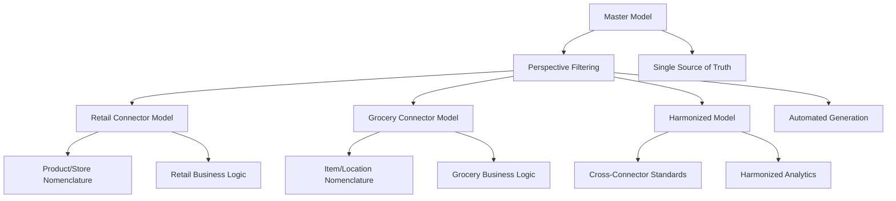

# Tutorial 2: Power BI Architecture Design

## 🎯 **Learning Objectives**

By the end of this tutorial, you will:
- Implement the master model pattern with perspective-based architecture
- Create systematic nomenclature transformation strategies
- Design enterprise semantic modeling patterns
- Build automated TMDL deployment workflows
- Develop cross-connector harmonization strategies

## 📋 **Prerequisites**

### **Required Knowledge**
- Completion of [Tutorial 1: Enterprise dbt Patterns](01-enterprise-dbt-patterns.md)
- Basic Power BI knowledge (DAX, data modeling)
- Understanding of dimensional modeling concepts
- Familiarity with star schema design

### **Required Tools**
- **Tabular Editor 3** (latest version)
- **Power BI Desktop** (latest version)
- **PowerShell 5.0+** for deployment scripts
- **Git** for version control
- **BigQuery** or equivalent data warehouse access

### **Environment Setup**
```bash
# Navigate to Power BI models directory
cd powerbi-models/master-model

# Verify Tabular Editor installation
TabularEditor3.exe --version

# Test model access
TabularEditor3.exe "model-folder"
```

## 📚 **Core Concepts**

### **Master Model Pattern Overview**

The Master Model Pattern allows you to maintain a single source of truth for all business logic while generating multiple connector-specific models through perspective-based filtering:



### **Perspective-Based Architecture**

Unlike annotation-based filtering, perspectives explicitly define object inclusion:

**Developer Perspectives:**
- `$retail_connector`: Product/Store nomenclature, retail-specific measures
- `$grocery_connector`: Item/Location nomenclature, promotional sales tracking
- `$harmonized`: Cross-connector standardized schema

**Key Benefits:**
- **Explicit Control**: Clear visibility of included objects
- **Clean Architecture**: No complex annotation logic
- **Dependency Management**: Automatic handling of object dependencies
- **Build-Time Filtering**: Simple `if(!object.InPerspective[version]) delete` approach

## 🔨 **Hands-On Implementation**

### **Step 1: Understanding the Master Model Structure**

Navigate to the master model:
```bash
cd powerbi-models/master-model/model-folder
```

**Examine the Model Definition:**
```tmdl
// model.tmdl
model Model
    culture: en-US
    defaultPowerBIDataSourceVersion: powerBI_V3
    discourageImplicitMeasures

    /// User perspective for sales analysis
    perspective 'Sales Analysis'
        annotation DevPerspectives = "$harmonized,$grocery_connector,$retail_connector"

    /// User perspective for inventory analysis  
    perspective 'Inventory Analysis'
        annotation DevPerspectives = "$harmonized,$grocery_connector,$retail_connector"
```

**Key Architecture Elements:**
- **User Perspectives**: Business-focused views (Sales Analysis, Inventory Analysis)
- **Developer Perspectives**: Technical filtering (`$retail_connector`, `$grocery_connector`, `$harmonized`)
- **Annotation System**: Perspective routing with DevPerspectives annotation

### **Step 2: Implementing Perspective-Based Object Assignment**

**Examine a Perspective Definition:**
```tmdl
// perspectives/$retail_connector.tmdl
perspective $retail_connector

    perspectiveTable 'Fact Sales'
        perspectiveMeasure 'Sales Amount'
        perspectiveMeasure 'Sales Quantity'
        perspectiveMeasure 'Average Selling Price'
        perspectiveMeasure 'Transaction Count'
        // Note: Promotional measures excluded for retail
        
        perspectiveColumn sales_id
        perspectiveColumn date_key
        perspectiveColumn store_id
        perspectiveColumn product_id
        perspectiveColumn sales_amount
        perspectiveColumn sales_quantity

    perspectiveTable 'Dim Product'
        perspectiveColumn product_id
        perspectiveColumn Product
        perspectiveColumn 'Product Brand'
        perspectiveColumn 'Product Category'
        // All product-specific columns included
```

**Practice Exercise:**
Create a new perspective for a restaurant connector:

```tmdl
// Your task: Create $restaurant_connector.tmdl
// Requirements:
// 1. Include basic sales measures
// 2. Use Menu/Location nomenclature instead of Product/Store
// 3. Add restaurant-specific columns (table_number, server_id)
// 4. Include appropriate dimension attributes
```

### **Step 3: Systematic Nomenclature Transformation**

**Understanding the Transformation System:**

The grocery connector automatically transforms Product→Item and Store→Location across all objects:

```csharp
// Child model generation script excerpt
// Systematic table name transformations
foreach(var table in Model.Tables) {
    if(table.Name.Contains("Product")) {
        table.Name = table.Name.Replace("Product", "Item");
    }
    if(table.Name.Contains("Store")) {
        table.Name = table.Name.Replace("Store", "Location");
    }
}

// Column name transformations
foreach(var column in table.Columns) {
    if(column.Name.Contains("product")) {
        column.Name = column.Name.Replace("product", "item");
    }
    if(column.Name.Contains("store")) {
        column.Name = column.Name.Replace("store", "location");
    }
}
```

**Custom Transformation Override:**
```tmdl
// For specific overrides beyond systematic transformation
column sales_amount
    dataType: decimal
    summarizeBy: sum
    annotation '$grocery_connector_ColumnName' = "sales_dollars"
    annotation '$retail_connector_ColumnName' = "revenue_amount"
```

### **Step 4: Advanced Measure Implementation**

**Multi-Connector Measure Pattern:**
```tmdl
// Fact Sales.tmdl - measure definitions
measure 'Sales Amount' = SUM('Fact Sales'[sales_amount])
    displayFolder: Measures
    formatString: $ #,##0.00;($ #,##0.00)

measure 'Regular Sales Amount' = SUM('Fact Sales'[regular_sales_amount])
    displayFolder: Measures
    formatString: $ #,##0.00;($ #,##0.00)
    // This measure only included in grocery_connector perspective

measure 'Promotional Sales Amount' = SUM('Fact Sales'[promotional_sales_amount])
    displayFolder: Measures
    formatString: $ #,##0.00;($ #,##0.00)
    // This measure only included in grocery_connector perspective
    
measure 'Total Sales Amount (Grocery)' = 
    [Regular Sales Amount] + [Promotional Sales Amount]
    displayFolder: Measures
    formatString: $ #,##0.00;($ #,##0.00)
    // Grocery-specific calculated measure
```

**Perspective Assignment for Measures:**
```tmdl
// perspectives/$grocery_connector.tmdl
perspectiveTable 'Fact Sales'
    perspectiveMeasure 'Sales Amount'
    perspectiveMeasure 'Regular Sales Amount'        // Grocery-specific
    perspectiveMeasure 'Promotional Sales Amount'    // Grocery-specific
    perspectiveMeasure 'Total Sales Amount (Grocery)' // Grocery-specific

// perspectives/$retail_connector.tmdl  
perspectiveTable 'Fact Sales'
    perspectiveMeasure 'Sales Amount'
    perspectiveMeasure 'Sales Quantity'
    // Regular/Promotional measures excluded from retail perspective
```

**Practice Exercise:**
Create connector-specific measures for inventory:

```dax
// Your task: Create these measures and assign to appropriate perspectives
// 1. On Hand Quantity (all connectors)
// 2. Available Quantity (grocery only - on hand minus allocated)
// 3. On Order Quantity (grocery only)
// 4. Weeks of Supply (all connectors - on hand / average weekly sales)
// 5. Inventory Turns (retail only - sales / average inventory)
```

### **Step 5: Data Source Configuration**

**Multi-Connector Data Source Strategy:**
```tmdl
// Table annotations for connector-specific data sources
table 'Fact Sales'
    annotation '$harmonized.BigQuery.TableId' = 
        'modern-data-stack-showcase.dbt_analytics.analytics_harmonized_fact_sales'
    annotation '$grocery_connector.BigQuery.TableId' = 
        'modern-data-stack-showcase.dbt_analytics.analytics_grocery_connector_fact_sales'
    annotation '$retail_connector.BigQuery.TableId' = 
        'modern-data-stack-showcase.dbt_analytics.analytics_retail_connector_fact_sales'
```

**Child Model Script Data Source Updates:**
```csharp
// Child model generation script - data source configuration
foreach(var partition in table.Partitions) {
    var sourceAnnotation = table.GetAnnotation($"{version}.BigQuery.TableId");
    if(sourceAnnotation != null) {
        // Update partition source to connector-specific table
        partition.Source = $"SELECT * FROM `{sourceAnnotation}`";
    }
}
```

### **Step 6: Advanced Time Intelligence Implementation**

**Dim Calendar with Monday Week Start:**
```m
// Power Query M for Dim Calendar generation
let
    StartDate = #date(2020, 1, 1),
    EndDate = #date(2030, 12, 31),
    NumberOfDays = Duration.Days(EndDate - StartDate) + 1,
    DateList = List.Dates(StartDate, NumberOfDays, #duration(1, 0, 0, 0)),
    
    TableFromList = Table.FromList(DateList, Splitter.SplitByNothing(), {"Date"}),
    
    // Monday-start week calculations
    AddedColumns = Table.AddColumn(TableFromList, "Week Start", 
        each Date.StartOfWeek([Date], Day.Monday)),
    AddedWeekEnd = Table.AddColumn(AddedColumns, "Week End",
        each Date.EndOfWeek([Date], Day.Monday)),
    
    // Additional time intelligence columns
    AddedYear = Table.AddColumn(AddedWeekEnd, "Year", 
        each Date.Year([Date])),
    AddedMonth = Table.AddColumn(AddedYear, "Month Number",
        each Date.Month([Date])),
    AddedQuarter = Table.AddColumn(AddedMonth, "Quarter Number",
        each Date.QuarterOfYear([Date])),
        
    // Business calendar considerations
    AddedIsWeekend = Table.AddColumn(AddedQuarter, "Is Weekend",
        each Date.DayOfWeek([Date], Day.Monday) >= 5),
    AddedFiscalYear = Table.AddColumn(AddedIsWeekend, "Fiscal Year",
        each if Date.Month([Date]) >= 7 then Date.Year([Date]) + 1 else Date.Year([Date]))
        
in AddedFiscalYear
```

**Dynamic Time Period Dimension:**
```dax
// Dim Time Period - Dynamic periods based on current date
VAR CurrentDate = TODAY()
VAR WeekStart = CurrentDate - WEEKDAY(CurrentDate, 2) + 1  // Monday start

RETURN
UNION(
    // Current period
    ROW("Time Period", "Current Week", "Start Date", WeekStart, "End Date", WeekStart + 6),
    
    // Historical periods  
    ROW("Time Period", "Last Week", "Start Date", WeekStart - 7, "End Date", WeekStart - 1),
    ROW("Time Period", "Last 4 Weeks", "Start Date", WeekStart - 28, "End Date", WeekStart - 1),
    ROW("Time Period", "Last 13 Weeks", "Start Date", WeekStart - 91, "End Date", WeekStart - 1),
    
    // Year-to-date calculations
    ROW("Time Period", "YTD", "Start Date", DATE(YEAR(CurrentDate), 1, 1), "End Date", CurrentDate)
)
```

### **Step 7: Automated Deployment Workflow**

**PowerShell Deployment Script:**
```powershell
# scripts/deploy-child-models.ps1
param(
    [string]$TabularEditorPath = "TabularEditor3.exe",
    [string]$ServerName = "localhost",
    [switch]$Deploy
)

# Define child model configurations
$ChildModels = @{
    'retail_connector' = @{
        'ScriptPath' = 'scripts/child-models/$retail_connector.csx'
        'DatabaseName' = 'ModernDataStackRetail'
        'OutputPath' = '../retail-connector/model-folder'
    }
    'grocery_connector' = @{
        'ScriptPath' = 'scripts/child-models/$grocery_connector.csx'
        'DatabaseName' = 'ModernDataStackGrocery'  
        'OutputPath' = '../grocery-connector/model-folder'
    }
    'harmonized' = @{
        'ScriptPath' = 'scripts/child-models/$harmonized.csx'
        'DatabaseName' = 'ModernDataStackHarmonized'
        'OutputPath' = '../harmonized/model-folder'
    }
}

foreach($model in $ChildModels.GetEnumerator()) {
    Write-Host "Processing $($model.Key) model..." -ForegroundColor Green
    
    # Generate child model TMDL
    $generateCmd = "$TabularEditorPath `"model-folder`" -S `"$($model.Value.ScriptPath)`" -F `"$($model.Value.OutputPath)`""
    Write-Host "Executing: $generateCmd"
    Invoke-Expression $generateCmd
    
    if($Deploy) {
        # Deploy to Analysis Services
        $deployCmd = "$TabularEditorPath `"$($model.Value.OutputPath)`" -D `"$ServerName`" `"$($model.Value.DatabaseName)`" -O -R"
        Write-Host "Deploying: $deployCmd"
        Invoke-Expression $deployCmd
    }
}
```

**Child Model Generation Script:**
```csharp
// scripts/child-models/$grocery_connector.csx
var version = "$grocery_connector";

// Set model properties
Model.Database.ID = "Modern Data Stack Grocery Connector";
Model.Database.Name = "Modern Data Stack Grocery Connector";

// Remove objects not in perspective
foreach(var table in Model.Tables.ToList()) {
    if(!table.InPerspective[version]) {
        table.Delete();
    } else {
        // Remove measures not in perspective
        foreach(var measure in table.Measures.ToList()) {
            if(!measure.InPerspective[version]) measure.Delete();
        }
        
        // Remove columns not in perspective
        foreach(var column in table.Columns.ToList()) {
            if(!column.InPerspective[version]) column.Delete();
        }
    }
}

// Apply systematic nomenclature transformations
foreach(var table in Model.Tables) {
    // Transform table names
    if(table.Name.Contains("Product")) {
        table.Name = table.Name.Replace("Product", "Item");
    }
    if(table.Name.Contains("Store")) {
        table.Name = table.Name.Replace("Store", "Location");
    }
    
    // Transform column names and DAX expressions
    foreach(var column in table.Columns) {
        column.Name = column.Name.Replace("Product", "Item").Replace("Store", "Location");
    }
    
    // Update measure expressions
    foreach(var measure in table.Measures) {
        measure.Expression = measure.Expression
            .Replace("'Dim Product'", "'Dim Item'")
            .Replace("'Dim Store'", "'Dim Location'")
            .Replace("[Product ", "[Item ")
            .Replace("[Store ", "[Location ");
    }
}

// Update data sources for grocery connector
foreach(var table in Model.Tables) {
    var grocerySource = table.GetAnnotation($"{version}.BigQuery.TableId");
    if(grocerySource != null) {
        table.Partitions[0].Source = $"SELECT * FROM `{grocerySource}`";
    }
}
```

## 🧪 **Testing & Validation**

### **Model Validation Checklist**

**Perspective Testing:**
```bash
# Open master model
TabularEditor3.exe "model-folder"

# Test each perspective:
# 1. Switch to $retail_connector perspective
# 2. Verify only retail objects are visible
# 3. Check measure expressions are correct
# 4. Validate relationships are intact

# 3. Switch to $grocery_connector perspective  
# 4. Verify Item/Location nomenclature
# 5. Check promotional measures are included
# 6. Validate systematic transformations

# 5. Switch to $harmonized perspective
# 6. Verify cross-connector objects
# 7. Check standardized naming
```

**Child Model Generation Testing:**
```powershell
# Generate all child models
.\scripts\deploy-child-models.ps1

# Validate generated models
foreach($model in @('retail-connector', 'grocery-connector', 'harmonized')) {
    TabularEditor3.exe "../$model/model-folder" -A "
        // Validation script
        if(Model.Tables.Count == 0) throw new Exception('No tables found');
        if(Model.AllMeasures.Count == 0) throw new Exception('No measures found');
        
        // Validate naming conventions
        foreach(var table in Model.Tables) {
            if(table.Name.Contains('Product') && '$model' == 'grocery-connector') {
                throw new Exception('Product naming found in grocery model');
            }
        }
    "
}
```

### **DAX Expression Validation**

**Systematic Expression Testing:**
```dax
// Test measure expressions in each model
EVALUATE
SUMMARIZE(
    'Fact Sales',
    'Dim Product'[Product Category],  // Should be 'Item Category' in grocery
    "Total Sales", [Sales Amount],
    "Avg Price", [Average Selling Price]
)
```

**Cross-Model Consistency Check:**
```dax
// Validate measure calculations are consistent across models
EVALUATE
ROW(
    "Retail Sales", CALCULATE([Sales Amount], 'Dim Product'[Product] = "Sample Product"),
    "Grocery Sales", CALCULATE([Sales Amount], 'Dim Item'[Item] = "Sample Product"), 
    "Harmonized Sales", CALCULATE([Sales Amount], 'Dim Product'[Product] = "Sample Product")
)
```

## 🚀 **Production Deployment**

### **Multi-Environment Strategy**

**Development Environment:**
```yaml
# config/dev-deployment.yml
environments:
  development:
    server: "dev-powerbi.company.com"
    databases:
      retail: "DevModernDataStackRetail"
      grocery: "DevModernDataStackGrocery"
      harmonized: "DevModernDataStackHarmonized"
    data_sources:
      bigquery_project: "company-dev-analytics"
```

**Production Environment:**
```yaml
# config/prod-deployment.yml  
environments:
  production:
    server: "prod-powerbi.company.com"
    databases:
      retail: "ModernDataStackRetail"
      grocery: "ModernDataStackGrocery" 
      harmonized: "ModernDataStackHarmonized"
    data_sources:
      bigquery_project: "company-prod-analytics"
```

### **CI/CD Pipeline Integration**

**Azure DevOps Pipeline:**
```yaml
# azure-pipelines.yml
trigger:
  paths:
    include:
    - powerbi-models/master-model/*

pool:
  vmImage: 'windows-latest'

stages:
- stage: Validate
  jobs:
  - job: ValidateModel
    steps:
    - task: PowerShell@2
      inputs:
        targetType: 'inline'
        script: |
          # Install Tabular Editor
          Invoke-WebRequest -Uri "https://github.com/TabularEditor/TabularEditor3/releases/latest/download/TabularEditor3.Portable.zip" -OutFile "TE3.zip"
          Expand-Archive "TE3.zip" -DestinationPath "TabularEditor3"
          
          # Validate master model
          .\TabularEditor3\TabularEditor3.exe "powerbi-models/master-model/model-folder" -A "
            // Validation checks
            if(Model.Tables.Count == 0) throw new Exception('No tables in model');
            foreach(var perspective in Model.Perspectives.Where(p => p.Name.StartsWith('$'))) {
              var tableCount = Model.Tables.Count(t => t.InPerspective[perspective.Name]);
              if(tableCount == 0) throw new Exception($'No tables in perspective {perspective.Name}');
            }
          "

- stage: Deploy
  dependsOn: Validate
  condition: and(succeeded(), eq(variables['Build.SourceBranch'], 'refs/heads/main'))
  jobs:
  - deployment: DeployModels
    environment: 'production'
    strategy:
      runOnce:
        deploy:
          steps:
          - task: PowerShell@2
            inputs:
              targetType: 'filePath'
              filePath: 'powerbi-models/master-model/scripts/deploy-child-models.ps1'
              arguments: '-ServerName "$(PowerBIServer)" -Deploy'
```

### **Monitoring & Maintenance**

**Model Performance Monitoring:**
```dax
// Performance monitoring measures
Performance Monitoring Table = 
VAR RefreshTime = NOW()
VAR TableSizes = 
    UNION(
        ROW("Table", "Fact Sales", "Rows", COUNTROWS('Fact Sales')),
        ROW("Table", "Dim Product", "Rows", COUNTROWS('Dim Product')),
        ROW("Table", "Dim Store", "Rows", COUNTROWS('Dim Store'))
    )
VAR ModelSize = 
    SUMX(TableSizes, [Rows])

RETURN
ADDCOLUMNS(
    TableSizes,
    "Refresh Time", RefreshTime,
    "Total Model Size", ModelSize,
    "Table Size %", DIVIDE([Rows], ModelSize, 0)
)
```

**Automated Health Checks:**
```powershell
# scripts/health-check.ps1
$HealthChecks = @(
    @{
        Name = "Model Accessibility"
        Test = { TabularEditor3.exe "$model" -A "return Model.Tables.Count;" }
        Expected = { $_ -gt 0 }
    },
    @{
        Name = "Measure Functionality" 
        Test = { TabularEditor3.exe "$model" -A "return Model.AllMeasures.Count;" }
        Expected = { $_ -gt 10 }
    },
    @{
        Name = "Data Freshness"
        Test = { TabularEditor3.exe "$model" -A "return Model.Tables['Fact Sales'].RefreshTime;" }
        Expected = { (Get-Date) - [DateTime]$_ -lt [TimeSpan]::FromHours(24) }
    }
)

foreach($check in $HealthChecks) {
    $result = & $check.Test
    $passed = & $check.Expected $result
    Write-Host "$($check.Name): $(if($passed) {'PASS'} else {'FAIL'})" -ForegroundColor $(if($passed) {'Green'} else {'Red'})
}
```

## 📊 **Advanced Patterns**

### **Dynamic Measure Generation**

**Metadata-Driven Measures:**
```dax
// Generate measures from metadata table
VAR MeasureDefinitions = 
    DATATABLE(
        "Measure Name", STRING,
        "Expression Template", STRING,
        "Format", STRING,
        {
            {"Total Sales", "SUM(Sales[{amount_column}])", "Currency"},
            {"Avg Unit Price", "DIVIDE(SUM(Sales[{amount_column}]), SUM(Sales[{quantity_column}]))", "Currency"},
            {"Transaction Count", "DISTINCTCOUNT(Sales[{id_column}])", "Integer"}
        }
    )

// Apply to different connectors with column mapping
VAR RetailMapping = 
    DATATABLE(
        "Template Key", STRING, "Actual Column", STRING,
        {
            {"{amount_column}", "sales_amount"},
            {"{quantity_column}", "sales_quantity"}, 
            {"{id_column}", "sales_id"}
        }
    )
```

### **Cross-Model Lineage Tracking**

**Automated Lineage Documentation:**
```csharp
// Generate lineage documentation
var lineageData = new List<object>();

foreach(var table in Model.Tables) {
    foreach(var partition in table.Partitions) {
        // Extract source table from partition query
        var sourceMatch = Regex.Match(partition.Source, @"FROM `([^`]+)`");
        if(sourceMatch.Success) {
            lineageData.Add(new {
                TargetTable = table.Name,
                SourceTable = sourceMatch.Groups[1].Value,
                Connector = version,
                LastUpdated = DateTime.Now
            });
        }
    }
}

// Generate lineage report
var lineageJson = JsonConvert.SerializeObject(lineageData, Formatting.Indented);
File.WriteAllText($"lineage-{version}.json", lineageJson);
```

### **A/B Testing for Model Changes**

**Model Versioning Strategy:**
```csharp
// Version comparison script
var oldModel = TabularModelHandler.LoadFromFile("previous-version.bim");
var newModel = TabularModelHandler.LoadFromFile("current-version.bim");

var differences = new List<string>();

// Compare measure definitions
foreach(var newMeasure in newModel.AllMeasures) {
    var oldMeasure = oldModel.AllMeasures.FirstOrDefault(m => m.Name == newMeasure.Name);
    if(oldMeasure == null) {
        differences.Add($"New measure: {newMeasure.Name}");
    } else if(oldMeasure.Expression != newMeasure.Expression) {
        differences.Add($"Changed measure: {newMeasure.Name}");
    }
}

// Generate impact analysis report
File.WriteAllLines("model-changes.txt", differences);
```

## 🎯 **Key Takeaways**

### **Architecture Patterns Implemented**
1. **Master Model Pattern**: Single source of truth with perspective-based filtering
2. **Systematic Transformations**: Automated nomenclature changes across objects
3. **Multi-Connector Support**: Unified architecture supporting different business contexts
4. **Automated Deployment**: Scripts for consistent, repeatable deployments
5. **Perspective Architecture**: Clean separation without complex annotation logic
6. **Enterprise Time Intelligence**: Monday-start weeks with dynamic periods

### **Best Practices Learned**
- **Perspective-Based Design**: Explicit object inclusion over annotation complexity
- **Systematic Naming**: Automated transformations reduce manual errors
- **Modular Architecture**: Reusable patterns across different connectors
- **Version Control**: TMDL enables proper source control and change tracking
- **Automated Testing**: Validation scripts ensure model integrity

### **Production Readiness**
- **Scalable Deployment**: Automated workflows for multiple environments
- **Quality Assurance**: Comprehensive validation and health checks
- **Change Management**: Controlled deployment with impact analysis
- **Monitoring Integration**: Performance and health monitoring
- **Documentation**: Self-documenting architecture with lineage tracking

## 🔗 **Next Steps**

Excellent work! You've mastered enterprise Power BI architecture patterns. You're now ready for:

**Tutorial 3: ML Pipeline Engineering** where you'll learn to:
- Build production ML pipelines using your semantic models
- Implement automated feature engineering from Power BI data
- Create real-time scoring and monitoring systems
- Develop A/B testing frameworks for model improvements

**Continue your journey:** [Tutorial 3: ML Pipeline Engineering](03-ml-pipeline-engineering.md)

---

**📚 Additional Resources:**
- [Power BI Master Model Documentation](../../powerbi-models/master-model/README.md)
- [Tabular Editor Documentation](https://docs.tabulareditor.com/)
- [TMDL Reference Guide](https://docs.microsoft.com/en-us/analysis-services/tmdl/)
- [Power BI Architecture Blog](../blog/building-enterprise-grade-modern-data-stack.md) 