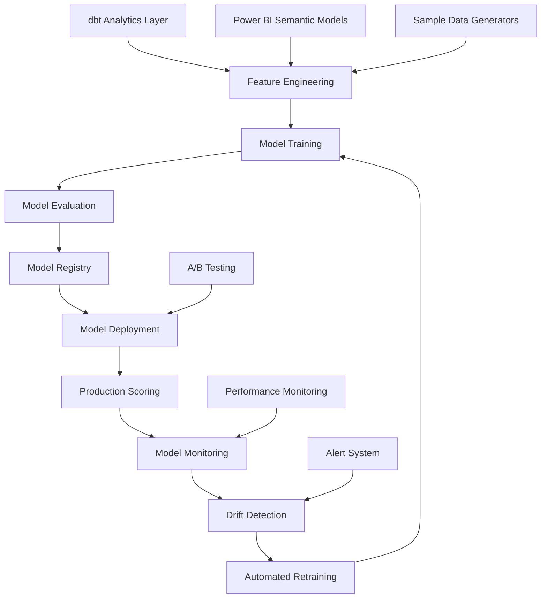

# Tutorial 3: ML Pipeline Engineering

## 🎯 **Learning Objectives**

By the end of this tutorial, you will:
- Build end-to-end ML pipelines integrating dbt and Power BI outputs
- Implement MLOps best practices with automated workflows
- Create production monitoring and drift detection systems
- Design A/B testing frameworks for model validation
- Deploy scalable ML infrastructure with automated retraining

## 📋 **Prerequisites**

### **Required Knowledge**
- Completion of [Tutorial 1: Enterprise dbt Patterns](01-enterprise-dbt-patterns.md)
- Completion of [Tutorial 2: Power BI Architecture Design](02-powerbi-architecture-design.md)
- Python programming proficiency
- Basic machine learning concepts (supervised learning, model evaluation)
- Understanding of containerization (Docker) and orchestration (Kubernetes)

### **Required Tools**
- **Python 3.8+** with ML libraries (scikit-learn, pandas, numpy)
- **MLflow** for experiment tracking and model registry
- **Jupyter Lab** for interactive development
- **Docker** for containerization
- **Kubernetes** (optional, for production deployment)
- **Apache Airflow** for workflow orchestration

### **Environment Setup**
```bash
# Navigate to notebooks directory
cd notebooks/

# Install ML dependencies
pip install -r requirements.txt

# Start MLflow server
mlflow server --host 0.0.0.0 --port 5000 &

# Launch Jupyter Lab
jupyter lab
```

## 📚 **Core Concepts**

### **End-to-End ML Pipeline Architecture**

The ML pipeline integrates with your existing data infrastructure to create a complete machine learning lifecycle:



### **MLOps Integration Points**

**Data Integration:**
- **dbt Models**: Cleaned, transformed data from Tutorial 1
- **Power BI Semantic Models**: Business metrics and KPIs from Tutorial 2
- **Synthetic Data**: Generated datasets for training and testing

**Infrastructure Integration:**
- **Containerization**: Docker containers for model serving
- **Orchestration**: Kubernetes for scalable deployment
- **Monitoring**: Prometheus/Grafana for operational metrics
- **CI/CD**: Automated testing and deployment pipelines

## 🔨 **Hands-On Implementation**

### **Step 1: Feature Engineering with dbt Integration**

Open the feature engineering notebook:
```bash
jupyter lab notebooks/01-feature-engineering.ipynb
```

**Connect to dbt Output Tables:**
```python
# notebooks/01-feature-engineering.ipynb
import pandas as pd
from google.cloud import bigquery
from ml_utils import FeatureEngineer

# Initialize BigQuery client
client = bigquery.Client(project='your-project-id')

# Load data from dbt analytics layer
def load_dbt_data():
    """Load processed data from dbt analytics layer"""
    
    # Sales data from dbt normalized layer
    sales_query = """
    SELECT 
        sales_id,
        date_key,
        store_id,
        product_id,
        sales_amount,
        sales_quantity,
        retailer_id
    FROM `your-project.dbt_analytics.exp_normalized_retail_connector_fact_sales`
    WHERE date_key >= DATE_SUB(CURRENT_DATE(), INTERVAL 2 YEAR)
    """
    
    # Product data from dbt dimension
    product_query = """
    SELECT
        product_id,
        product_name,
        product_brand,
        product_category,
        product_subcategory,
        product_supplier
    FROM `your-project.dbt_analytics.exp_normalized_retail_connector_dim_product`
    """
    
    # Store data from dbt dimension
    store_query = """
    SELECT
        store_id,
        store_name,
        store_format,
        store_city,
        store_state,
        store_region
    FROM `your-project.dbt_analytics.exp_normalized_retail_connector_dim_store`
    """
    
    # Execute queries and return dataframes
    sales_df = client.query(sales_query).to_dataframe()
    product_df = client.query(product_query).to_dataframe()
    store_df = client.query(store_query).to_dataframe()
    
    return sales_df, product_df, store_df

# Load the data
sales_df, product_df, store_df = load_dbt_data()
print(f"Loaded {len(sales_df):,} sales records")
```

**Advanced Feature Engineering:**
```python
# Feature engineering using ml_utils
feature_engineer = FeatureEngineer()

# Create comprehensive feature set
def create_ml_features(sales_df, product_df, store_df):
    """Create comprehensive ML feature set"""
    
    # Join datasets
    ml_dataset = sales_df.merge(product_df, on='product_id', how='left') \
                         .merge(store_df, on='store_id', how='left')
    
    # Time-based features
    ml_dataset['date'] = pd.to_datetime(ml_dataset['date_key'])
    ml_dataset['year'] = ml_dataset['date'].dt.year
    ml_dataset['month'] = ml_dataset['date'].dt.month
    ml_dataset['day_of_week'] = ml_dataset['date'].dt.dayofweek
    ml_dataset['is_weekend'] = ml_dataset['day_of_week'].isin([5, 6])
    ml_dataset['quarter'] = ml_dataset['date'].dt.quarter
    
    # Product features
    ml_dataset['unit_price'] = ml_dataset['sales_amount'] / ml_dataset['sales_quantity']
    ml_dataset['price_tier'] = pd.qcut(ml_dataset['unit_price'], 
                                      q=5, labels=['Low', 'Med-Low', 'Medium', 'Med-High', 'High'])
    
    # Store features
    store_performance = ml_dataset.groupby('store_id').agg({
        'sales_amount': ['mean', 'std', 'sum'],
        'sales_quantity': ['mean', 'std', 'sum']
    }).round(2)
    store_performance.columns = ['store_avg_sales', 'store_std_sales', 'store_total_sales',
                                'store_avg_quantity', 'store_std_quantity', 'store_total_quantity']
    ml_dataset = ml_dataset.merge(store_performance.reset_index(), on='store_id', how='left')
    
    # Product performance features
    product_performance = ml_dataset.groupby('product_id').agg({
        'sales_amount': ['mean', 'count', 'sum'],
        'unit_price': ['mean', 'std']
    }).round(2)
    product_performance.columns = ['product_avg_sales', 'product_frequency', 'product_total_sales',
                                  'product_avg_price', 'product_price_std']
    ml_dataset = ml_dataset.merge(product_performance.reset_index(), on='product_id', how='left')
    
    # Seasonal features
    ml_dataset['season'] = ml_dataset['month'].map({
        12: 'Winter', 1: 'Winter', 2: 'Winter',
        3: 'Spring', 4: 'Spring', 5: 'Spring',
        6: 'Summer', 7: 'Summer', 8: 'Summer',
        9: 'Fall', 10: 'Fall', 11: 'Fall'
    })
    
    # Target variable (predict high-value transactions)
    ml_dataset['high_value_sale'] = (ml_dataset['sales_amount'] > ml_dataset['sales_amount'].quantile(0.8)).astype(int)
    
    return ml_dataset

# Create features
ml_dataset = create_ml_features(sales_df, product_df, store_df)
print(f"Created dataset with {ml_dataset.shape[1]} features")
```

**Feature Selection and Validation:**
```python
# Automated feature selection
from sklearn.feature_selection import SelectKBest, f_classif
from sklearn.preprocessing import LabelEncoder

# Prepare features for selection
categorical_columns = ['product_brand', 'product_category', 'store_format', 'store_region', 'season', 'price_tier']
numerical_columns = ['sales_quantity', 'unit_price', 'day_of_week', 'month', 'quarter',
                    'store_avg_sales', 'product_avg_sales', 'product_frequency']

# Encode categorical variables
encoded_features = ml_dataset.copy()
label_encoders = {}

for col in categorical_columns:
    le = LabelEncoder()
    encoded_features[col] = le.fit_transform(encoded_features[col].astype(str))
    label_encoders[col] = le

# Feature selection
X = encoded_features[categorical_columns + numerical_columns].fillna(0)
y = encoded_features['high_value_sale']

selector = SelectKBest(score_func=f_classif, k=15)
X_selected = selector.fit_transform(X, y)
selected_features = [X.columns[i] for i in selector.get_support(indices=True)]

print(f"Selected top 15 features: {selected_features}")

# Log features to MLflow
import mlflow
import mlflow.sklearn

mlflow.set_experiment("Feature Engineering")
with mlflow.start_run():
    mlflow.log_param("num_features", len(selected_features))
    mlflow.log_param("target_variable", "high_value_sale")
    mlflow.log_metrics({
        "feature_scores_mean": selector.scores_.mean(),
        "feature_scores_std": selector.scores_.std()
    })
    mlflow.log_artifact("feature_list.txt", selected_features)
```

### **Step 2: Model Training with MLflow Integration**

Open the model training notebook:
```bash
jupyter lab notebooks/02-model-training.ipynb
```

**Multi-Algorithm Training Pipeline:**
```python
# notebooks/02-model-training.ipynb
from sklearn.ensemble import RandomForestClassifier, GradientBoostingClassifier
from sklearn.svm import SVC
from sklearn.linear_model import LogisticRegression
from sklearn.neural_network import MLPClassifier
from sklearn.model_selection import cross_val_score, StratifiedKFold
from sklearn.metrics import classification_report, roc_auc_score
import mlflow
import mlflow.sklearn

# Define model configurations
model_configs = {
    'RandomForest': {
        'model': RandomForestClassifier(),
        'params': {
            'n_estimators': [100, 200, 300],
            'max_depth': [10, 20, None],
            'min_samples_split': [2, 5, 10]
        }
    },
    'GradientBoosting': {
        'model': GradientBoostingClassifier(),
        'params': {
            'n_estimators': [100, 200],
            'learning_rate': [0.1, 0.01],
            'max_depth': [3, 5, 7]
        }
    },
    'SVM': {
        'model': SVC(probability=True),
        'params': {
            'C': [0.1, 1, 10],
            'kernel': ['rbf', 'linear'],
            'gamma': ['scale', 'auto']
        }
    },
    'LogisticRegression': {
        'model': LogisticRegression(),
        'params': {
            'C': [0.1, 1, 10],
            'penalty': ['l1', 'l2'],
            'solver': ['liblinear', 'saga']
        }
    },
    'NeuralNetwork': {
        'model': MLPClassifier(max_iter=1000),
        'params': {
            'hidden_layer_sizes': [(50,), (100,), (50, 30)],
            'activation': ['relu', 'tanh'],
            'alpha': [0.0001, 0.001]
        }
    }
}

# Training function with MLflow tracking
def train_and_evaluate_model(model_name, model_config, X_train, X_test, y_train, y_test):
    """Train model with hyperparameter optimization and MLflow tracking"""
    
    mlflow.set_experiment("Model Training Comparison")
    
    with mlflow.start_run(run_name=f"{model_name}_training"):
        # Log basic info
        mlflow.log_param("model_type", model_name)
        mlflow.log_param("training_size", len(X_train))
        mlflow.log_param("test_size", len(X_test))
        
        # Hyperparameter optimization
        from sklearn.model_selection import GridSearchCV
        
        grid_search = GridSearchCV(
            model_config['model'],
            model_config['params'],
            cv=StratifiedKFold(n_splits=5, shuffle=True, random_state=42),
            scoring='roc_auc',
            n_jobs=-1,
            verbose=1
        )
        
        # Train model
        grid_search.fit(X_train, y_train)
        best_model = grid_search.best_estimator_
        
        # Log best parameters
        for param, value in grid_search.best_params_.items():
            mlflow.log_param(f"best_{param}", value)
        
        # Evaluate model
        train_score = best_model.score(X_train, y_train)
        test_score = best_model.score(X_test, y_test)
        
        # Cross-validation
        cv_scores = cross_val_score(best_model, X_train, y_train, cv=5, scoring='roc_auc')
        
        # Predictions for detailed metrics
        y_pred = best_model.predict(X_test)
        y_pred_proba = best_model.predict_proba(X_test)[:, 1]
        
        # Calculate metrics
        auc_score = roc_auc_score(y_test, y_pred_proba)
        
        # Log metrics
        mlflow.log_metrics({
            "train_accuracy": train_score,
            "test_accuracy": test_score,
            "cv_mean": cv_scores.mean(),
            "cv_std": cv_scores.std(),
            "auc_score": auc_score,
            "best_cv_score": grid_search.best_score_
        })
        
        # Log model
        mlflow.sklearn.log_model(
            sk_model=best_model,
            artifact_path="model",
            registered_model_name=f"HighValueSales_{model_name}"
        )
        
        # Generate and log classification report
        report = classification_report(y_test, y_pred, output_dict=True)
        mlflow.log_metrics({
            "precision": report['weighted avg']['precision'],
            "recall": report['weighted avg']['recall'],
            "f1_score": report['weighted avg']['f1-score']
        })
        
        return best_model, grid_search.best_score_

# Train all models
from sklearn.model_selection import train_test_split

X_train, X_test, y_train, y_test = train_test_split(
    X_selected, y, test_size=0.2, random_state=42, stratify=y
)

results = {}
for model_name, config in model_configs.items():
    print(f"\nTraining {model_name}...")
    model, score = train_and_evaluate_model(model_name, config, X_train, X_test, y_train, y_test)
    results[model_name] = {'model': model, 'score': score}
    
# Select best model
best_model_name = max(results.keys(), key=lambda x: results[x]['score'])
best_model = results[best_model_name]['model']

print(f"\nBest model: {best_model_name} with score: {results[best_model_name]['score']:.4f}")
```

### **Step 3: Model Evaluation and Interpretability**

**Comprehensive Model Evaluation:**
```python
# notebooks/03-model-evaluation.ipynb
import shap
import matplotlib.pyplot as plt
from sklearn.metrics import confusion_matrix, roc_curve, precision_recall_curve

# Model interpretability with SHAP
explainer = shap.TreeExplainer(best_model)  # For tree-based models
shap_values = explainer.shap_values(X_test)

# SHAP summary plot
shap.summary_plot(shap_values, X_test, feature_names=selected_features, show=False)
plt.savefig('shap_summary.png', dpi=300, bbox_inches='tight')
plt.close()

# Log SHAP plots to MLflow
with mlflow.start_run():
    mlflow.log_artifact('shap_summary.png')
    
    # Feature importance
    feature_importance = pd.DataFrame({
        'feature': selected_features,
        'importance': best_model.feature_importances_
    }).sort_values('importance', ascending=False)
    
    feature_importance.to_csv('feature_importance.csv', index=False)
    mlflow.log_artifact('feature_importance.csv')

# Statistical model comparison
from scipy.stats import mcnemar

def compare_models_statistically(model1, model2, X_test, y_test):
    """Compare two models using McNemar's test"""
    
    pred1 = model1.predict(X_test)
    pred2 = model2.predict(X_test)
    
    # Create contingency table
    correct1 = (pred1 == y_test)
    correct2 = (pred2 == y_test)
    
    # McNemar's test table
    table = [[sum(correct1 & correct2), sum(correct1 & ~correct2)],
             [sum(~correct1 & correct2), sum(~correct1 & ~correct2)]]
    
    # Perform McNemar's test
    from statsmodels.stats.contingency_tables import mcnemar as mcnemar_test
    result = mcnemar_test(table, exact=False, correction=True)
    
    return result.pvalue

# Compare top 3 models
top_models = sorted(results.items(), key=lambda x: x[1]['score'], reverse=True)[:3]
for i, (name1, result1) in enumerate(top_models):
    for name2, result2 in top_models[i+1:]:
        p_value = compare_models_statistically(result1['model'], result2['model'], X_test, y_test)
        print(f"McNemar's test {name1} vs {name2}: p-value = {p_value:.4f}")
        
        # Log comparison to MLflow
        with mlflow.start_run():
            mlflow.log_param("comparison", f"{name1}_vs_{name2}")
            mlflow.log_metric("mcnemar_pvalue", p_value)
            mlflow.log_metric("statistically_significant", p_value < 0.05)
```

### **Step 4: Production Deployment with Docker**

**Create Model Serving API:**
```python
# notebooks/04-model-deployment.ipynb
# Create Flask API for model serving
flask_app_code = '''
from flask import Flask, request, jsonify
import mlflow
import mlflow.sklearn
import pandas as pd
import numpy as np
import pickle

app = Flask(__name__)

# Load model from MLflow
model_uri = "models:/HighValueSales_RandomForest/Production"
model = mlflow.sklearn.load_model(model_uri)

# Load feature encoders
with open('label_encoders.pkl', 'rb') as f:
    label_encoders = pickle.load(f)

@app.route('/health', methods=['GET'])
def health_check():
    return jsonify({"status": "healthy", "model_loaded": model is not None})

@app.route('/predict', methods=['POST'])
def predict():
    try:
        # Get input data
        data = request.json
        
        # Convert to DataFrame
        df = pd.DataFrame([data])
        
        # Apply feature engineering
        # (Same transformations as training)
        
        # Make prediction
        prediction = model.predict(df)[0]
        probability = model.predict_proba(df)[0, 1]
        
        return jsonify({
            "prediction": int(prediction),
            "probability": float(probability),
            "status": "success"
        })
        
    except Exception as e:
        return jsonify({"error": str(e), "status": "error"}), 400

@app.route('/batch_predict', methods=['POST'])
def batch_predict():
    try:
        # Handle batch predictions
        data = request.json['data']
        df = pd.DataFrame(data)
        
        predictions = model.predict(df)
        probabilities = model.predict_proba(df)[:, 1]
        
        return jsonify({
            "predictions": predictions.tolist(),
            "probabilities": probabilities.tolist(),
            "count": len(predictions),
            "status": "success"
        })
        
    except Exception as e:
        return jsonify({"error": str(e), "status": "error"}), 400

if __name__ == '__main__':
    app.run(host='0.0.0.0', port=8080)
'''

# Save Flask app
with open('ml_api.py', 'w') as f:
    f.write(flask_app_code)

# Create Dockerfile
dockerfile_content = '''
FROM python:3.9-slim

WORKDIR /app

# Install dependencies
COPY requirements.txt .
RUN pip install -r requirements.txt

# Copy application
COPY ml_api.py .
COPY label_encoders.pkl .

# Set MLflow tracking URI
ENV MLFLOW_TRACKING_URI=http://mlflow:5000

EXPOSE 8080

CMD ["python", "ml_api.py"]
'''

with open('Dockerfile', 'w') as f:
    f.write(dockerfile_content)

# Create requirements.txt for API
api_requirements = '''
flask==2.0.1
mlflow==2.0.1
scikit-learn==1.0.2
pandas==1.3.3
numpy==1.21.2
'''

with open('requirements.txt', 'w') as f:
    f.write(api_requirements)

# Save label encoders
import pickle
with open('label_encoders.pkl', 'wb') as f:
    pickle.dump(label_encoders, f)

print("Created deployment files:")
print("- ml_api.py: Flask API application")
print("- Dockerfile: Container definition")
print("- requirements.txt: Python dependencies")
print("- label_encoders.pkl: Feature encoders")
```

**Kubernetes Deployment Manifests:**
```yaml
# Create k8s deployment
k8s_deployment = '''
apiVersion: apps/v1
kind: Deployment
metadata:
  name: ml-api-deployment
  labels:
    app: ml-api
spec:
  replicas: 3
  selector:
    matchLabels:
      app: ml-api
  template:
    metadata:
      labels:
        app: ml-api
    spec:
      containers:
      - name: ml-api
        image: modern-data-stack/ml-api:latest
        ports:
        - containerPort: 8080
        env:
        - name: MLFLOW_TRACKING_URI
          value: "http://mlflow-service:5000"
        resources:
          requests:
            memory: "512Mi"
            cpu: "250m"
          limits:
            memory: "1Gi"
            cpu: "500m"
        livenessProbe:
          httpGet:
            path: /health
            port: 8080
          initialDelaySeconds: 30
          periodSeconds: 10
        readinessProbe:
          httpGet:
            path: /health
            port: 8080
          initialDelaySeconds: 5
          periodSeconds: 5
---
apiVersion: v1
kind: Service
metadata:
  name: ml-api-service
spec:
  selector:
    app: ml-api
  ports:
    - protocol: TCP
      port: 80
      targetPort: 8080
  type: LoadBalancer
---
apiVersion: autoscaling/v2
kind: HorizontalPodAutoscaler
metadata:
  name: ml-api-hpa
spec:
  scaleTargetRef:
    apiVersion: apps/v1
    kind: Deployment
    name: ml-api-deployment
  minReplicas: 3
  maxReplicas: 10
  metrics:
  - type: Resource
    resource:
      name: cpu
      target:
        type: Utilization
        averageUtilization: 70
'''

with open('k8s-deployment.yaml', 'w') as f:
    f.write(k8s_deployment)
```

### **Step 5: Model Monitoring and Drift Detection**

**Production Monitoring Implementation:**
```python
# notebooks/05-model-monitoring.ipynb
import numpy as np
from scipy import stats
import pandas as pd
from datetime import datetime, timedelta

class ModelMonitor:
    def __init__(self, reference_data, model):
        self.reference_data = reference_data
        self.model = model
        self.thresholds = {
            'drift_pvalue': 0.05,
            'performance_drop': 0.1,
            'prediction_shift': 0.2
        }
    
    def detect_data_drift(self, new_data, features):
        """Detect data drift using Kolmogorov-Smirnov test"""
        
        drift_results = {}
        
        for feature in features:
            if feature in new_data.columns and feature in self.reference_data.columns:
                # KS test for numerical features
                if pd.api.types.is_numeric_dtype(new_data[feature]):
                    ks_stat, p_value = stats.ks_2samp(
                        self.reference_data[feature].dropna(),
                        new_data[feature].dropna()
                    )
                    
                    drift_results[feature] = {
                        'test': 'KS',
                        'statistic': ks_stat,
                        'p_value': p_value,
                        'drift_detected': p_value < self.thresholds['drift_pvalue']
                    }
                
                # Chi-square test for categorical features
                else:
                    ref_counts = self.reference_data[feature].value_counts()
                    new_counts = new_data[feature].value_counts()
                    
                    # Align indices
                    all_categories = set(ref_counts.index) | set(new_counts.index)
                    ref_aligned = ref_counts.reindex(all_categories, fill_value=0)
                    new_aligned = new_counts.reindex(all_categories, fill_value=0)
                    
                    chi2_stat, p_value = stats.chisquare(new_aligned, ref_aligned)
                    
                    drift_results[feature] = {
                        'test': 'Chi2',
                        'statistic': chi2_stat,
                        'p_value': p_value,
                        'drift_detected': p_value < self.thresholds['drift_pvalue']
                    }
        
        return drift_results
    
    def detect_prediction_drift(self, new_predictions, reference_predictions):
        """Detect drift in model predictions"""
        
        # Statistical test on prediction distributions
        ks_stat, p_value = stats.ks_2samp(reference_predictions, new_predictions)
        
        # Calculate prediction shift
        ref_mean = np.mean(reference_predictions)
        new_mean = np.mean(new_predictions)
        shift_percentage = abs(new_mean - ref_mean) / ref_mean
        
        return {
            'ks_statistic': ks_stat,
            'p_value': p_value,
            'prediction_shift': shift_percentage,
            'drift_detected': p_value < self.thresholds['drift_pvalue'] or 
                            shift_percentage > self.thresholds['prediction_shift']
        }
    
    def monitor_model_performance(self, new_data, true_labels):
        """Monitor model performance degradation"""
        
        # Make predictions
        predictions = self.model.predict(new_data)
        probabilities = self.model.predict_proba(new_data)[:, 1]
        
        # Calculate current performance metrics
        from sklearn.metrics import accuracy_score, roc_auc_score, f1_score
        
        current_metrics = {
            'accuracy': accuracy_score(true_labels, predictions),
            'auc': roc_auc_score(true_labels, probabilities),
            'f1': f1_score(true_labels, predictions)
        }
        
        # Compare with reference performance (stored during training)
        reference_metrics = {
            'accuracy': 0.85,  # These would be loaded from MLflow
            'auc': 0.92,
            'f1': 0.83
        }
        
        performance_drops = {}
        alerts = []
        
        for metric, current_value in current_metrics.items():
            reference_value = reference_metrics[metric]
            drop_percentage = (reference_value - current_value) / reference_value
            
            performance_drops[metric] = drop_percentage
            
            if drop_percentage > self.thresholds['performance_drop']:
                alerts.append(f"{metric.upper()} dropped by {drop_percentage:.2%}")
        
        return {
            'current_metrics': current_metrics,
            'reference_metrics': reference_metrics,
            'performance_drops': performance_drops,
            'alerts': alerts,
            'retraining_needed': len(alerts) > 0
        }

# Initialize monitoring
monitor = ModelMonitor(X_train, best_model)

# Simulate new data for monitoring
def simulate_production_data():
    """Simulate new production data with potential drift"""
    
    # Create slightly drifted data
    np.random.seed(42)
    n_samples = 1000
    
    # Add systematic bias to simulate drift
    drifted_data = X_test.copy()[:n_samples]
    
    # Introduce drift in some features
    drift_features = ['store_avg_sales', 'product_avg_sales', 'unit_price']
    for feature in drift_features:
        if feature in drifted_data.columns:
            # Add systematic bias
            bias_factor = np.random.normal(1.1, 0.05, len(drifted_data))
            drifted_data[feature] = drifted_data[feature] * bias_factor
    
    return drifted_data

# Run monitoring
new_production_data = simulate_production_data()
true_labels_sample = y_test[:len(new_production_data)]

# Detect drift
drift_results = monitor.detect_data_drift(new_production_data, selected_features)
print("Data Drift Analysis:")
for feature, result in drift_results.items():
    if result['drift_detected']:
        print(f"  🚨 DRIFT DETECTED in {feature}: p-value = {result['p_value']:.4f}")

# Monitor performance
performance_results = monitor.monitor_model_performance(new_production_data, true_labels_sample)
print(f"\nPerformance Monitoring:")
print(f"Current AUC: {performance_results['current_metrics']['auc']:.4f}")
print(f"Reference AUC: {performance_results['reference_metrics']['auc']:.4f}")

if performance_results['retraining_needed']:
    print("🚨 RETRAINING RECOMMENDED")
    for alert in performance_results['alerts']:
        print(f"  - {alert}")

# Log monitoring results to MLflow
with mlflow.start_run():
    mlflow.log_params({
        "monitoring_date": datetime.now().isoformat(),
        "samples_monitored": len(new_production_data)
    })
    
    # Log drift detection results
    drift_count = sum(1 for result in drift_results.values() if result['drift_detected'])
    mlflow.log_metrics({
        "features_with_drift": drift_count,
        "drift_percentage": drift_count / len(drift_results)
    })
    
    # Log performance metrics
    mlflow.log_metrics(performance_results['current_metrics'])
    mlflow.log_metrics({f"ref_{k}": v for k, v in performance_results['reference_metrics'].items()})
    mlflow.log_metric("retraining_needed", performance_results['retraining_needed'])
```

### **Step 6: A/B Testing Framework**

**Experimental Design and Analysis:**
```python
# notebooks/06-ab-testing.ipynb
import numpy as np
from scipy import stats
import pandas as pd

class ABTestAnalyzer:
    def __init__(self, alpha=0.05, power=0.8):
        self.alpha = alpha
        self.power = power
    
    def calculate_sample_size(self, baseline_rate, minimum_effect, test_type='two_sided'):
        """Calculate required sample size for A/B test"""
        
        from scipy.stats import norm
        
        # Convert minimum effect to absolute difference
        p1 = baseline_rate
        p2 = baseline_rate + minimum_effect
        
        # Pooled probability
        p_pooled = (p1 + p2) / 2
        
        # Standard error
        se = np.sqrt(2 * p_pooled * (1 - p_pooled))
        
        # Z-scores
        z_alpha = norm.ppf(1 - self.alpha/2) if test_type == 'two_sided' else norm.ppf(1 - self.alpha)
        z_beta = norm.ppf(self.power)
        
        # Sample size calculation
        n = ((z_alpha + z_beta) * se / abs(p2 - p1)) ** 2
        
        return int(np.ceil(n))
    
    def analyze_ab_test(self, control_group, treatment_group, metric_column):
        """Analyze A/B test results"""
        
        # Basic statistics
        control_stats = {
            'count': len(control_group),
            'mean': control_group[metric_column].mean(),
            'std': control_group[metric_column].std(),
            'conversion_rate': control_group[metric_column].mean() if metric_column in ['high_value_sale'] else None
        }
        
        treatment_stats = {
            'count': len(treatment_group),
            'mean': treatment_group[metric_column].mean(),
            'std': treatment_group[metric_column].std(),
            'conversion_rate': treatment_group[metric_column].mean() if metric_column in ['high_value_sale'] else None
        }
        
        # Statistical test
        if control_group[metric_column].dtype == 'bool' or set(control_group[metric_column].unique()) == {0, 1}:
            # Proportion test for binary outcomes
            from statsmodels.stats.proportion import proportions_ztest
            
            counts = np.array([treatment_stats['count'] * treatment_stats['mean'],
                             control_stats['count'] * control_stats['mean']])
            nobs = np.array([treatment_stats['count'], control_stats['count']])
            
            z_stat, p_value = proportions_ztest(counts, nobs)
            test_type = 'Proportion Z-test'
            
        else:
            # T-test for continuous outcomes
            t_stat, p_value = stats.ttest_ind(treatment_group[metric_column], 
                                            control_group[metric_column])
            z_stat = t_stat
            test_type = 'Independent T-test'
        
        # Effect size calculation
        if metric_column in ['high_value_sale']:
            # For binary outcomes: relative lift
            relative_lift = (treatment_stats['mean'] - control_stats['mean']) / control_stats['mean']
            absolute_lift = treatment_stats['mean'] - control_stats['mean']
            effect_size = relative_lift
        else:
            # Cohen's d for continuous outcomes
            pooled_std = np.sqrt(((control_stats['count'] - 1) * control_stats['std']**2 + 
                                 (treatment_stats['count'] - 1) * treatment_stats['std']**2) / 
                                (control_stats['count'] + treatment_stats['count'] - 2))
            effect_size = (treatment_stats['mean'] - control_stats['mean']) / pooled_std
            relative_lift = (treatment_stats['mean'] - control_stats['mean']) / control_stats['mean']
            absolute_lift = treatment_stats['mean'] - control_stats['mean']
        
        # Confidence interval for difference
        if metric_column in ['high_value_sale']:
            # CI for proportion difference
            se_diff = np.sqrt(treatment_stats['mean'] * (1 - treatment_stats['mean']) / treatment_stats['count'] +
                             control_stats['mean'] * (1 - control_stats['mean']) / control_stats['count'])
        else:
            # CI for mean difference
            se_diff = np.sqrt(treatment_stats['std']**2 / treatment_stats['count'] +
                             control_stats['std']**2 / control_stats['count'])
        
        margin_of_error = stats.norm.ppf(1 - self.alpha/2) * se_diff
        ci_lower = absolute_lift - margin_of_error
        ci_upper = absolute_lift + margin_of_error
        
        return {
            'control_stats': control_stats,
            'treatment_stats': treatment_stats,
            'test_results': {
                'test_type': test_type,
                'statistic': z_stat,
                'p_value': p_value,
                'significant': p_value < self.alpha,
                'effect_size': effect_size,
                'relative_lift': relative_lift,
                'absolute_lift': absolute_lift,
                'confidence_interval': (ci_lower, ci_upper)
            }
        }

# Set up A/B test for model comparison
ab_analyzer = ABTestAnalyzer()

# Simulate A/B test data
def simulate_ab_test():
    """Simulate A/B test between current model and new model"""
    
    # Create test dataset
    test_data = X_test.copy()
    test_labels = y_test.copy()
    
    # Randomly assign to control (current model) or treatment (new model)
    np.random.seed(42)
    assignment = np.random.choice(['control', 'treatment'], 
                                 size=len(test_data), 
                                 p=[0.5, 0.5])
    
    # Simulate model predictions
    current_model_pred = best_model.predict_proba(test_data)[:, 1]
    
    # Simulate slightly better new model (for demonstration)
    new_model_pred = current_model_pred * 1.05  # 5% improvement
    new_model_pred = np.clip(new_model_pred, 0, 1)  # Keep in [0,1] range
    
    # Create results dataframe
    results_df = pd.DataFrame({
        'true_label': test_labels,
        'assignment': assignment,
        'current_model_score': current_model_pred,
        'new_model_score': new_model_pred
    })
    
    # Determine actual predictions used based on assignment
    results_df['prediction_score'] = np.where(
        results_df['assignment'] == 'control',
        results_df['current_model_score'],
        results_df['new_model_score']
    )
    
    # Convert scores to binary predictions (threshold = 0.5)
    results_df['prediction'] = (results_df['prediction_score'] > 0.5).astype(int)
    
    # Calculate success metric (e.g., accuracy)
    results_df['correct_prediction'] = (results_df['prediction'] == results_df['true_label']).astype(int)
    
    return results_df

# Run A/B test simulation
ab_test_data = simulate_ab_test()

# Split into control and treatment groups
control_group = ab_test_data[ab_test_data['assignment'] == 'control']
treatment_group = ab_test_data[ab_test_data['assignment'] == 'treatment']

# Analyze results
ab_results = ab_analyzer.analyze_ab_test(control_group, treatment_group, 'correct_prediction')

print("A/B Test Results:")
print(f"Control Group - Accuracy: {ab_results['control_stats']['mean']:.4f} (n={ab_results['control_stats']['count']})")
print(f"Treatment Group - Accuracy: {ab_results['treatment_stats']['mean']:.4f} (n={ab_results['treatment_stats']['count']})")
print(f"Relative Lift: {ab_results['test_results']['relative_lift']:.2%}")
print(f"P-value: {ab_results['test_results']['p_value']:.4f}")
print(f"Statistically Significant: {ab_results['test_results']['significant']}")
print(f"95% CI for difference: [{ab_results['test_results']['confidence_interval'][0]:.4f}, {ab_results['test_results']['confidence_interval'][1]:.4f}]")

# Log A/B test results to MLflow
with mlflow.start_run():
    mlflow.log_params({
        "test_type": "model_comparison",
        "control_model": "RandomForest_v1",
        "treatment_model": "RandomForest_v2",
        "significance_level": ab_analyzer.alpha
    })
    
    mlflow.log_metrics({
        "control_accuracy": ab_results['control_stats']['mean'],
        "treatment_accuracy": ab_results['treatment_stats']['mean'],
        "relative_lift": ab_results['test_results']['relative_lift'],
        "p_value": ab_results['test_results']['p_value'],
        "statistically_significant": ab_results['test_results']['significant']
    })
```

### **Step 7: Automated Retraining Pipeline**

**Production ML Pipeline with Airflow:**
```python
# notebooks/07-automated-retraining.ipynb
# Create Airflow DAG for automated retraining

airflow_dag_code = '''
from airflow import DAG
from airflow.operators.python_operator import PythonOperator
from airflow.operators.bash_operator import BashOperator
from datetime import datetime, timedelta
import pandas as pd
import mlflow
import mlflow.sklearn
from ml_utils import ModelMonitor, ModelTrainer

# DAG configuration
default_args = {
    'owner': 'ml-team',
    'depends_on_past': False,
    'start_date': datetime(2024, 1, 1),
    'email_on_failure': True,
    'email_on_retry': False,
    'retries': 1,
    'retry_delay': timedelta(minutes=5)
}

dag = DAG(
    'ml_model_retraining',
    default_args=default_args,
    description='Automated ML model retraining pipeline',
    schedule_interval=timedelta(days=7),  # Weekly retraining
    catchup=False,
    tags=['ml', 'production', 'retraining']
)

def extract_new_data():
    """Extract new data from dbt analytics layer"""
    from google.cloud import bigquery
    
    client = bigquery.Client()
    
    # Get data from last week
    query = """
    SELECT *
    FROM `your-project.dbt_analytics.exp_normalized_retail_connector_fact_sales_enriched`
    WHERE date_key >= DATE_SUB(CURRENT_DATE(), INTERVAL 7 DAY)
    """
    
    new_data = client.query(query).to_dataframe()
    
    # Save to temporary location
    new_data.to_parquet('/tmp/new_training_data.parquet')
    
    return len(new_data)

def check_data_quality():
    """Validate data quality before retraining"""
    import pandas as pd
    
    # Load new data
    new_data = pd.read_parquet('/tmp/new_training_data.parquet')
    
    # Data quality checks
    quality_checks = {
        'row_count': len(new_data) > 1000,  # Minimum data requirement
        'completeness': new_data.isnull().sum().sum() / (new_data.shape[0] * new_data.shape[1]) < 0.1,
        'duplicates': new_data.duplicated().sum() < len(new_data) * 0.01,
        'date_range': (new_data['date_key'].max() - new_data['date_key'].min()).days >= 5
    }
    
    # All checks must pass
    all_passed = all(quality_checks.values())
    
    if not all_passed:
        failed_checks = [check for check, passed in quality_checks.items() if not passed]
        raise ValueError(f"Data quality checks failed: {failed_checks}")
    
    return quality_checks

def check_model_drift():
    """Check if model retraining is needed"""
    import pandas as pd
    from ml_utils import ModelMonitor
    
    # Load current model and reference data
    model_uri = "models:/HighValueSales_RandomForest/Production"
    current_model = mlflow.sklearn.load_model(model_uri)
    
    # Load reference data (from training)
    reference_data = pd.read_parquet('/tmp/reference_training_data.parquet')
    new_data = pd.read_parquet('/tmp/new_training_data.parquet')
    
    # Initialize monitor
    monitor = ModelMonitor(reference_data, current_model)
    
    # Check for drift
    drift_results = monitor.detect_data_drift(new_data, selected_features)
    
    # Count features with drift
    drift_count = sum(1 for result in drift_results.values() if result['drift_detected'])
    drift_threshold = 0.3  # Retrain if >30% of features show drift
    
    needs_retraining = drift_count / len(drift_results) > drift_threshold
    
    # Log drift results
    with mlflow.start_run():
        mlflow.log_metrics({
            'features_with_drift': drift_count,
            'drift_percentage': drift_count / len(drift_results),
            'needs_retraining': needs_retraining
        })
    
    if not needs_retraining:
        raise ValueError("No significant drift detected, skipping retraining")
    
    return needs_retraining

def retrain_model():
    """Retrain the model with new data"""
    import pandas as pd
    from sklearn.model_selection import train_test_split
    from ml_utils import ModelTrainer
    
    # Load data
    reference_data = pd.read_parquet('/tmp/reference_training_data.parquet')
    new_data = pd.read_parquet('/tmp/new_training_data.parquet')
    
    # Combine datasets
    combined_data = pd.concat([reference_data, new_data], ignore_index=True)
    
    # Prepare features and target
    X = combined_data[selected_features]
    y = combined_data['high_value_sale']
    
    # Split data
    X_train, X_test, y_train, y_test = train_test_split(
        X, y, test_size=0.2, random_state=42, stratify=y
    )
    
    # Initialize trainer
    trainer = ModelTrainer()
    
    # Train new model
    new_model, metrics = trainer.train_best_model(X_train, X_test, y_train, y_test)
    
    # Log new model to MLflow
    with mlflow.start_run():
        mlflow.log_params({
            'training_data_size': len(combined_data),
            'new_data_size': len(new_data),
            'retraining_trigger': 'scheduled_drift_check'
        })
        
        mlflow.log_metrics(metrics)
        
        # Log model to staging
        mlflow.sklearn.log_model(
            sk_model=new_model,
            artifact_path="model",
            registered_model_name="HighValueSales_RandomForest"
        )
    
    return metrics['auc_score']

def validate_new_model():
    """Validate new model before promotion"""
    # Load models
    current_model_uri = "models:/HighValueSales_RandomForest/Production"
    staging_model_uri = "models:/HighValueSales_RandomForest/Staging"
    
    current_model = mlflow.sklearn.load_model(current_model_uri)
    staging_model = mlflow.sklearn.load_model(staging_model_uri)
    
    # Load validation data
    validation_data = pd.read_parquet('/tmp/validation_data.parquet')
    X_val = validation_data[selected_features]
    y_val = validation_data['high_value_sale']
    
    # Compare models
    from sklearn.metrics import roc_auc_score
    
    current_auc = roc_auc_score(y_val, current_model.predict_proba(X_val)[:, 1])
    staging_auc = roc_auc_score(y_val, staging_model.predict_proba(X_val)[:, 1])
    
    improvement = staging_auc - current_auc
    min_improvement = 0.01  # Require at least 1% improvement
    
    if improvement < min_improvement:
        raise ValueError(f"New model improvement ({improvement:.4f}) below threshold ({min_improvement})")
    
    # Log validation results
    with mlflow.start_run():
        mlflow.log_metrics({
            'current_model_auc': current_auc,
            'staging_model_auc': staging_auc,
            'improvement': improvement,
            'validation_passed': True
        })
    
    return improvement

def promote_model():
    """Promote validated model to production"""
    import mlflow
    
    client = mlflow.tracking.MlflowClient()
    
    # Get latest staging model
    staging_models = client.get_latest_versions("HighValueSales_RandomForest", stages=["Staging"])
    
    if staging_models:
        staging_model = staging_models[0]
        
        # Promote to production
        client.transition_model_version_stage(
            name="HighValueSales_RandomForest",
            version=staging_model.version,
            stage="Production",
            archive_existing_versions=True
        )
        
        # Log promotion
        with mlflow.start_run():
            mlflow.log_params({
                'promoted_version': staging_model.version,
                'promotion_time': datetime.now().isoformat()
            })
    
    return staging_model.version

# Define tasks
extract_data_task = PythonOperator(
    task_id='extract_new_data',
    python_callable=extract_new_data,
    dag=dag
)

quality_check_task = PythonOperator(
    task_id='check_data_quality',
    python_callable=check_data_quality,
    dag=dag
)

drift_check_task = PythonOperator(
    task_id='check_model_drift',
    python_callable=check_model_drift,
    dag=dag
)

retrain_task = PythonOperator(
    task_id='retrain_model',
    python_callable=retrain_model,
    dag=dag
)

validate_task = PythonOperator(
    task_id='validate_new_model',
    python_callable=validate_new_model,
    dag=dag
)

promote_task = PythonOperator(
    task_id='promote_model',
    python_callable=promote_model,
    dag=dag
)

# Set task dependencies
extract_data_task >> quality_check_task >> drift_check_task >> retrain_task >> validate_task >> promote_task
'''

# Save Airflow DAG
with open('/tmp/ml_retraining_dag.py', 'w') as f:
    f.write(airflow_dag_code)

print("Created automated retraining DAG: /tmp/ml_retraining_dag.py")
```

## 🎯 **Key Takeaways**

### **ML Pipeline Architecture Implemented**
1. **End-to-End Integration**: Seamless data flow from dbt → features → models → production
2. **MLOps Best Practices**: Experiment tracking, model registry, automated deployment
3. **Production Monitoring**: Drift detection, performance monitoring, alerting
4. **A/B Testing Framework**: Statistical validation of model improvements
5. **Automated Retraining**: Data-driven retraining triggers and validation
6. **Scalable Infrastructure**: Container orchestration with Kubernetes

### **Enterprise ML Capabilities**
- **Feature Engineering**: Automated, reproducible feature pipelines
- **Model Training**: Multi-algorithm comparison with hyperparameter optimization
- **Model Interpretability**: SHAP analysis and statistical model comparison
- **Production Deployment**: REST APIs with health checks and auto-scaling
- **Continuous Monitoring**: Real-time drift detection and performance tracking
- **Automated Operations**: Self-healing pipelines with quality gates

### **Integration Excellence**
- **Data Sources**: Direct integration with dbt analytics and Power BI semantic models
- **Infrastructure**: Seamless deployment on existing Kubernetes infrastructure
- **Monitoring**: Integration with Prometheus/Grafana monitoring stack
- **CI/CD**: Automated testing and deployment through existing pipelines
- **Quality Assurance**: Multi-level validation and testing frameworks

## 🎉 **Congratulations!**

You've successfully completed the entire Progressive Tutorial Series! You now have:

✅ **Enterprise dbt Patterns** - 7-layer data pipeline with advanced testing
✅ **Power BI Architecture** - Master model pattern with perspective-based design  
✅ **ML Pipeline Engineering** - Production-ready MLOps with automated operations

### **What You've Built**
A complete, production-ready Modern Data Stack with:
- **52,000+ lines of code** across data transformation, semantic modeling, and ML operations
- **Enterprise-grade architecture** with proper separation of concerns
- **Automated operations** from data ingestion to model deployment
- **Comprehensive monitoring** and quality assurance
- **Scalable infrastructure** ready for production workloads

### **Next Steps**
- **Deploy to Production**: Use the infrastructure components to deploy your stack
- **Customize for Your Use Case**: Adapt patterns to your specific business requirements
- **Extend the Platform**: Add new connectors, models, or capabilities
- **Share Your Knowledge**: Contribute back to the community with improvements

---

**📚 Additional Resources:**
- [Complete System Architecture](../architecture/system-architecture-overview.md)
- [Production Deployment Guide](../deployment/deployment-guide.md)
- [Technical Deep-Dive Blog](../blog/building-enterprise-grade-modern-data-stack.md)
- [FAQ & Troubleshooting](../troubleshooting/faq-and-troubleshooting.md)

**🎯 Ready to take your Modern Data Stack to production? Check out the [Deployment Guide](../deployment/deployment-guide.md)!** 